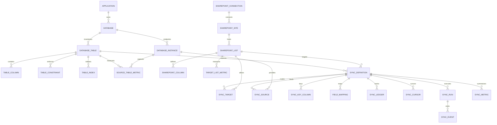

# Arcore SyncBridge Data Model and Database Architecture

This document defines the meta-store schema for Arcore SyncBridge as the central hub for all Arcore databases. It captures parent applications, logical databases, physical database instances, table metadata, and SharePoint targets, then drives sync definitions and ledger tracking. It also supports multiple source endpoints and mutable database locations without creating duplicate sync items.

## 1. Database technology strategy
- Primary database: PostgreSQL
- Interface: SQLAlchemy + Alembic migrations
- Normalization strategy: 3NF for inventory and config, JSONB for flexible metadata
- Storage strategy: JSONB for introspection snapshots and policies

## 2. Core tables

### applications
Represents a parent application or product domain.
- id (UUID, PK)
- name (text)
- owner_team (text)
- description (text)
- status (ACTIVE, ARCHIVED)
- created_at (timestamp)

### databases
Represents a logical database (stable identity), decoupled from physical endpoints.
- id (UUID, PK)
- application_id (FK -> applications)
- name (text)
- db_type (POSTGRES, SQLSERVER, MYSQL)
- environment (DEV, STAGING, PROD)
- database_name (text)
- status (ACTIVE, DISABLED)
- created_at (timestamp)

### database_instances
Represents physical database endpoints. Multiple instances allow multi-source sync and location changes.
- id (UUID, PK)
- database_id (FK -> databases)
- instance_label (text)
- host (text)
- port (integer)
- db_name (text) - actual database name
- db_user (text) - database username
- db_password (text) - database password (encrypted at rest, future: vault/KMS)
- config (JSONB) - additional configuration (SSL, timeout, etc.)
- role (PRIMARY, SECONDARY)
- priority (integer)
- status (ACTIVE, DISABLED)
- valid_from (timestamp, nullable)
- valid_to (timestamp, nullable)
- last_verified_at (timestamp, nullable)
- created_at (timestamp)
- updated_at (timestamp)

Note: Credentials are stored on the instance record. Future enhancement: migrate to vault/KMS with rotation.

### database_tables
Inventory of tables per database.
- id (UUID, PK)
- database_id (FK -> databases)
- schema_name (text)
- table_name (text)
- table_type (BASE, VIEW)
- primary_key (text)
- row_estimate (bigint)
- last_introspected_at (timestamp)

### table_columns
Detailed column metadata for a selected table.
- id (UUID, PK)
- table_id (FK -> database_tables)
- ordinal_position (integer)
- column_name (text)
- data_type (text)
- is_nullable (boolean)
- default_value (text)
- is_identity (boolean)
- is_primary_key (boolean)
- is_unique (boolean)

### table_constraints
Constraint definitions for a table.
- id (UUID, PK)
- table_id (FK -> database_tables)
- constraint_name (text)
- constraint_type (PRIMARY_KEY, FOREIGN_KEY, UNIQUE, CHECK)
- columns (JSONB)
- referenced_table (text)
- definition (text)

### table_indexes
Index metadata for a table.
- id (UUID, PK)
- table_id (FK -> database_tables)
- index_name (text)
- is_unique (boolean)
- index_method (text)
- columns (JSONB)
- definition (text)

### source_table_metrics
Source table metrics captured per database instance.
- id (UUID, PK)
- table_id (FK -> database_tables)
- database_instance_id (FK -> database_instances)
- captured_at (timestamp)
- row_count (bigint)
- max_updated_at (timestamp, nullable)

### sharepoint_connections
Represents Graph app credentials and tenant context.
- id (UUID, PK)
- name (text) - friendly name for the connection
- tenant_id (text)
- client_id (text)
- client_secret (text) - encrypted at rest, primary auth source (env vars are dev fallback)
- authority_host (text) - defaults to https://login.microsoftonline.com
- scopes (JSONB) - Graph API scopes, defaults to ["https://graph.microsoft.com/.default"]
- status (ACTIVE, DISABLED)
- last_verified_at (timestamp, nullable)
- created_at (timestamp)
- updated_at (timestamp)

Note: client_secret is the primary authentication source. Environment variables are used as fallback for local development only.

### sharepoint_sites
Canonical SharePoint site inventory.
- id (UUID, PK)
- connection_id (FK -> sharepoint_connections)
- tenant_id (text)
- hostname (text)
- site_path (text)
- site_id (text)
- web_url (text)
- status (ACTIVE, DISABLED)

### sharepoint_lists
Target lists, either selected or provisioned.
- id (UUID, PK)
- site_id (FK -> sharepoint_sites)
- list_id (text)
- display_name (text)
- description (text)
- template (text)
- is_provisioned (boolean)
- last_provisioned_at (timestamp)

### target_list_metrics
SharePoint list metrics captured per list.
- id (UUID, PK)
- target_list_id (FK -> sharepoint_lists)
- captured_at (timestamp)
- item_count (bigint)
- last_modified_at (timestamp, nullable)

### sharepoint_columns
List column metadata for mapping.
- id (UUID, PK)
- list_id (FK -> sharepoint_lists)
- column_name (text)
- column_type (text)
- is_required (boolean)
- is_readonly (boolean)

### sync_definitions
Defines how a database table maps to a SharePoint list.
- id (UUID, PK)
- name (text)
- source_table_id (FK -> database_tables)
- target_list_id (FK -> sharepoint_lists)
- sync_mode (ONE_WAY_PUSH, TWO_WAY, ARCHIVE_ONLY)
- conflict_policy (SOURCE_WINS, DESTINATION_WINS, LATEST_WINS)
- key_strategy (PRIMARY_KEY, UNIQUE_CONSTRAINT, COMPOSITE_COLUMNS, HASHED)
- key_constraint_name (text)
- target_strategy (SINGLE, CONDITIONAL)
- cursor_strategy (UPDATED_AT, LSN, FULL_SCAN)
- cursor_column_id (FK -> table_columns, nullable)
- sharding_policy (JSONB)
- schedule_cron (text)
- is_enabled (boolean)

### sync_targets
Allowed SharePoint targets for a sync definition (multi-list routing).
- id (UUID, PK)
- sync_def_id (FK -> sync_definitions)
- target_list_id (FK -> sharepoint_lists)
- connection_id (FK -> sharepoint_connections) - per-target SharePoint context
- site_id (FK -> sharepoint_sites) - per-target SharePoint context
- is_default (boolean)
- priority (integer)
- status (ACTIVE, DISABLED)
- created_at (timestamp)
- updated_at (timestamp)

### sync_sources
Binds a sync definition to one or more database instances.
- id (UUID, PK)
- sync_def_id (FK -> sync_definitions)
- database_instance_id (FK -> database_instances)
- role (PRIMARY, SECONDARY)
- priority (integer)
- is_enabled (boolean)

### sync_key_columns
Selected composite key columns used when row UID is unstable.
- id (UUID, PK)
- sync_def_id (FK -> sync_definitions)
- column_id (FK -> table_columns)
- ordinal_position (integer)
- is_required (boolean)

Row identity strategy: compute source_identity from the key strategy and key columns (ordered, delimiter-joined). Store a stable source_identity_hash (SHA-256) in the ledger to avoid duplicates if source row IDs change.

### field_mappings
Maps table columns to SharePoint columns with directional control.
- id (UUID, PK)
- sync_def_id (FK -> sync_definitions)
- source_column_id (FK -> table_columns)
- source_column_name (text) - denormalized for quick lookup
- target_column_id (FK -> sharepoint_columns)
- target_column_name (text) - denormalized for quick lookup
- target_type (text) - SharePoint column type
- sync_direction (BIDIRECTIONAL, PUSH_ONLY, PULL_ONLY)
- is_system_field (boolean) - true for readonly SharePoint system fields (ID, Created, Modified)
- transform_rule (text)
- is_key (boolean)
- created_at (timestamp)
- updated_at (timestamp)

### introspection_runs
Tracks each metadata extraction run per database.
- id (UUID, PK)
- database_instance_id (FK -> database_instances)
- started_at (timestamp)
- ended_at (timestamp)
- status (SUCCESS, FAILED)
- stats (JSONB)

### sync_ledger
Idempotent mapping between source rows and SharePoint items with loop prevention.
- id (UUID, PK)
- sync_def_id (FK -> sync_definitions) - scoped per definition
- source_identity (text) - human-readable composite key
- source_identity_hash (text) - SHA-256 hash for uniqueness
- source_key_strategy (PRIMARY_KEY, UNIQUE_CONSTRAINT, COMPOSITE_COLUMNS, HASHED)
- source_instance_id (FK -> database_instances, nullable) - tracks which instance last synced
- sp_list_id (text) - SharePoint list GUID
- sp_item_id (integer) - SharePoint item ID
- content_hash (text) - SHA-256 hash of synchronized content for change detection
- last_source_ts (timestamp) - last modified time from source
- last_sync_ts (timestamp) - last sync operation time
- provenance (PUSH, PULL) - direction of last sync for loop prevention
- created_at (timestamp)
- updated_at (timestamp)

### sync_cursors
Persisted cursors for incremental sync (source watermarks and Graph delta links).
- id (UUID, PK)
- sync_def_id (FK -> sync_definitions)
- cursor_scope (SOURCE, TARGET) - whether cursor is for source DB or target SharePoint
- cursor_type (TIMESTAMP, LSN, DELTA_LINK) - type of cursor strategy
- cursor_value (text) - actual cursor value (timestamp, LSN, or delta URL)
- source_instance_id (FK -> database_instances, nullable) - for source cursors
- target_list_id (FK -> sharepoint_lists, nullable) - for target cursors
- last_run_id (FK -> sync_runs, nullable)
- updated_at (timestamp)
- created_at (timestamp)

Note: Cursors are scoped by (sync_def_id, cursor_scope, source_instance_id, target_list_id) to support:
- Multiple source instances per definition
- Multiple target lists per definition (sharding)
- Separate push and pull cursors

### schema_snapshots
Snapshots of table metadata for drift detection.
- id (UUID, PK)
- table_id (FK -> database_tables)
- database_instance_id (FK -> database_instances)
- captured_at (timestamp)
- columns (JSONB)
- constraints (JSONB)
- indexes (JSONB)

### sync_runs
Tracks each sync execution with detailed metrics and status.
- id (UUID, PK)
- sync_def_id (FK -> sync_definitions)
- run_type (PUSH, INGRESS, CDC) - type of sync operation
- status (RUNNING, COMPLETED, FAILED)
- start_time (timestamp)
- end_time (timestamp, nullable)
- items_processed (integer) - total items attempted
- items_failed (integer) - number of failed items
- error_message (text, nullable) - error details if failed
- created_at (timestamp)

### sync_metrics
Rollup metrics per sync definition and target list.
- id (UUID, PK)
- sync_def_id (FK -> sync_definitions)
- source_instance_id (FK -> database_instances)
- target_list_id (FK -> sharepoint_lists)
- last_sync_ts (timestamp)
- total_rows_synced (bigint)
- last_run_id (FK -> sync_runs)
- last_reconcile_at (timestamp)
- source_row_count (bigint)
- target_row_count (bigint)
- reconcile_delta (bigint)
- reconcile_status (MATCH, MISMATCH, UNKNOWN)

### sync_events
- id (UUID, PK)
- sync_run_id (FK -> sync_runs)
- severity (INFO, WARN, ERROR)
- event_type (text)
- message (text)
- payload (JSONB)

## 3. Relationships (ERD)

## 4. Indexing strategy
- databases: unique on (application_id, database_name, environment)
- database_instances: index on (database_id, status, priority)
- database_tables: unique on (database_id, schema_name, table_name)
- table_columns: unique on (table_id, column_name)
- table_constraints: index on (table_id, constraint_type)
- table_indexes: index on (table_id, is_unique)
- source_table_metrics: index on (table_id, database_instance_id, captured_at)
- sharepoint_connections: unique on (tenant_id, client_id)
- sharepoint_lists: unique on (site_id, list_id)
- target_list_metrics: index on (target_list_id, captured_at)
- field_mappings: unique on (sync_def_id, source_column_id)
- sync_targets: unique on (sync_def_id, target_list_id)
- sync_key_columns: unique on (sync_def_id, column_id)
- sync_ledger: unique on (sync_def_id, source_identity_hash)
- sync_cursors: unique on (sync_def_id, cursor_scope, source_instance_id, target_list_id)
- sync_metrics: unique on (sync_def_id, source_instance_id, target_list_id)
- sync_runs: index on (sync_def_id, started_at)
