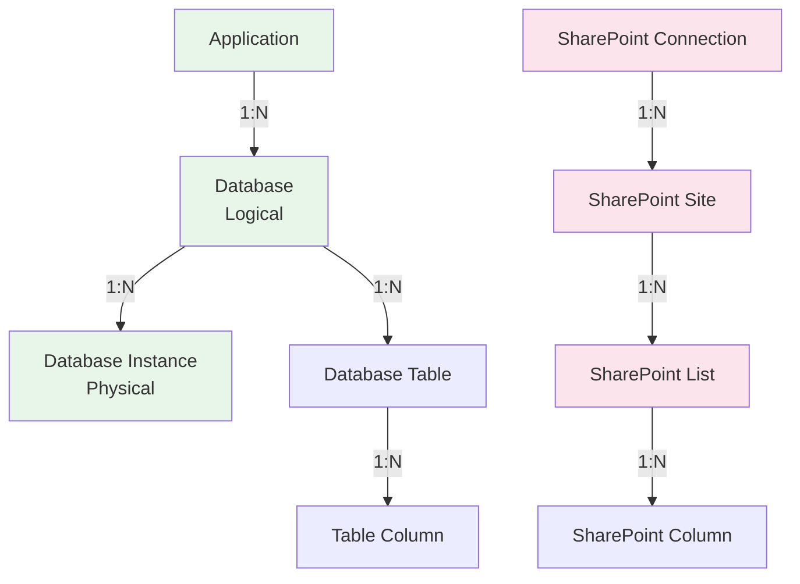
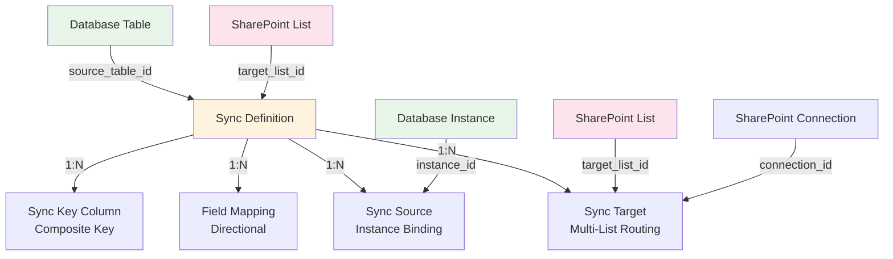
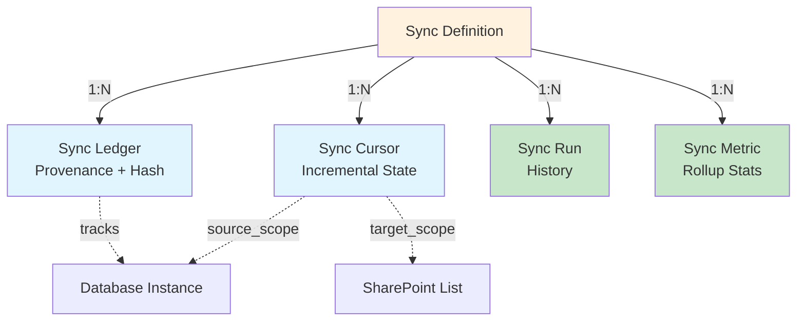
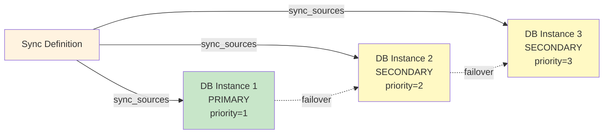
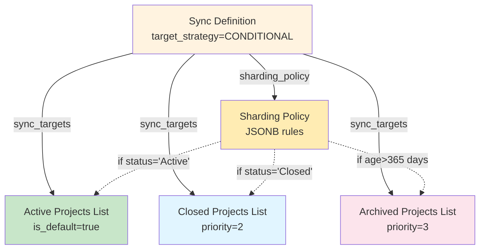
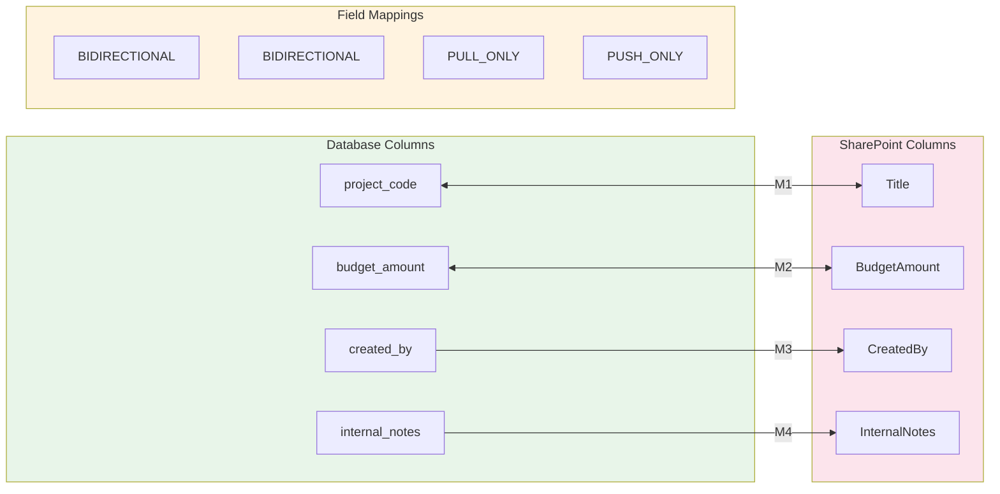
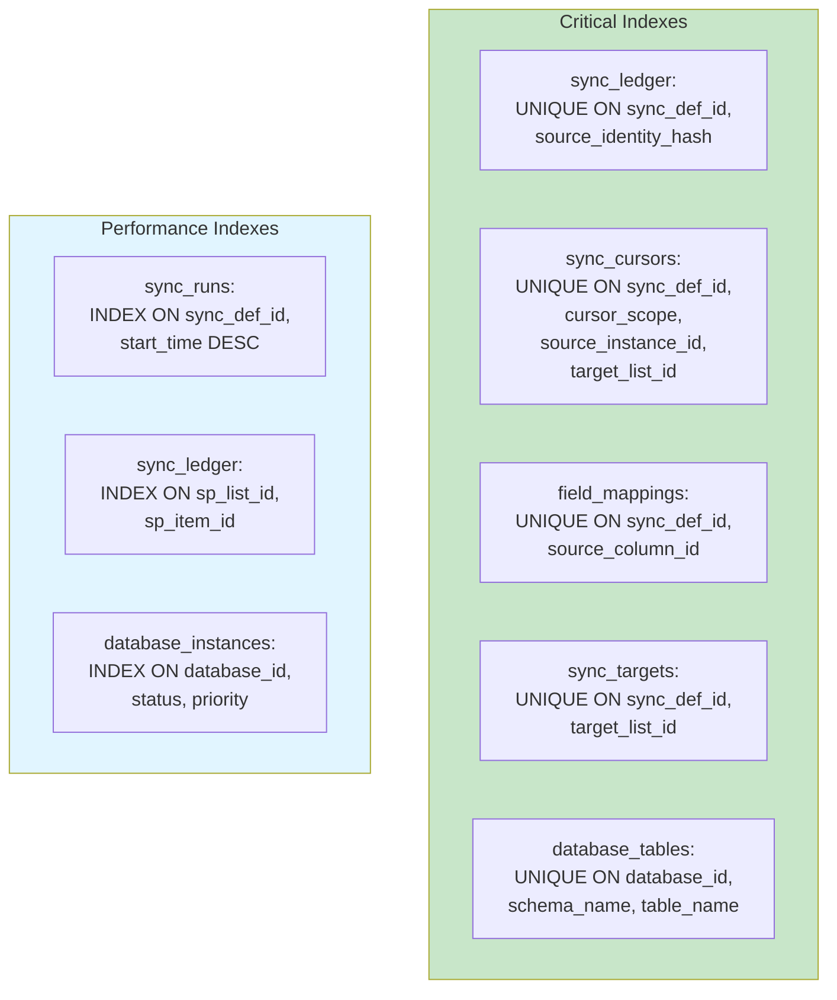

# Database Schema Visuals

## Complete Meta-Store ER Diagram

```mermaid
erDiagram
    APPLICATION ||--o{ DATABASE : owns
    DATABASE ||--o{ DATABASE_INSTANCE : endpoints
    DATABASE ||--o{ DATABASE_TABLE : inventories
    DATABASE_TABLE ||--o{ TABLE_COLUMN : contains
    DATABASE_TABLE ||--o{ TABLE_CONSTRAINT : enforces
    DATABASE_TABLE ||--o{ TABLE_INDEX : indexes
    DATABASE_TABLE ||--o{ SOURCE_TABLE_METRIC : measures
    DATABASE_INSTANCE ||--o{ SOURCE_TABLE_METRIC : captures

    SHAREPOINT_CONNECTION ||--o{ SHAREPOINT_SITE : connects
    SHAREPOINT_SITE ||--o{ SHAREPOINT_LIST : hosts
    SHAREPOINT_LIST ||--o{ SHAREPOINT_COLUMN : defines
    SHAREPOINT_LIST ||--o{ TARGET_LIST_METRIC : measures

    DATABASE_TABLE ||--o{ SYNC_DEFINITION : sources
    SHAREPOINT_LIST ||--o{ SYNC_DEFINITION : primary_target
    SYNC_DEFINITION ||--o{ SYNC_TARGET : routes
    SHAREPOINT_LIST ||--o{ SYNC_TARGET : allows
    SHAREPOINT_CONNECTION ||--o{ SYNC_TARGET : uses
    SHAREPOINT_SITE ||--o{ SYNC_TARGET : scopes

    SYNC_DEFINITION ||--o{ SYNC_SOURCE : binds
    DATABASE_INSTANCE ||--o{ SYNC_SOURCE : provides

    SYNC_DEFINITION ||--o{ SYNC_KEY_COLUMN : keys
    TABLE_COLUMN ||--o{ SYNC_KEY_COLUMN : identifies

    SYNC_DEFINITION ||--o{ FIELD_MAPPING : maps
    TABLE_COLUMN ||--o{ FIELD_MAPPING : sources
    SHAREPOINT_COLUMN ||--o{ FIELD_MAPPING : targets

    SYNC_DEFINITION ||--o{ SYNC_LEDGER : tracks
    DATABASE_INSTANCE ||--o{ SYNC_LEDGER : sourced_from

    SYNC_DEFINITION ||--o{ SYNC_CURSOR : cursors
    DATABASE_INSTANCE ||--o{ SYNC_CURSOR : source_scope
    SHAREPOINT_LIST ||--o{ SYNC_CURSOR : target_scope

    SYNC_DEFINITION ||--o{ SYNC_RUN : executes
    SYNC_DEFINITION ||--o{ SYNC_METRIC : summarizes

    APPLICATION {
        uuid id PK
        string name
        string owner_team
        string description
        string status
        timestamp created_at
    }

    DATABASE {
        uuid id PK
        uuid application_id FK
        string name
        string db_type
        string environment
        string database_name
        string status
        timestamp created_at
    }

    DATABASE_INSTANCE {
        uuid id PK
        uuid database_id FK
        string instance_label
        string host
        int port
        string db_name
        string db_user
        string db_password
        jsonb config
        string role
        int priority
        string status
        timestamp created_at
    }

    DATABASE_TABLE {
        uuid id PK
        uuid database_id FK
        string schema_name
        string table_name
        string table_type
        string primary_key
        bigint row_estimate
        timestamp last_introspected_at
    }

    TABLE_COLUMN {
        uuid id PK
        uuid table_id FK
        int ordinal_position
        string column_name
        string data_type
        boolean is_nullable
        string default_value
        boolean is_primary_key
    }

    TABLE_CONSTRAINT {
        uuid id PK
        uuid table_id FK
        string constraint_name
        string constraint_type
        jsonb columns
    }

    TABLE_INDEX {
        uuid id PK
        uuid table_id FK
        string index_name
        boolean is_unique
        string index_method
        jsonb columns
    }

    SHAREPOINT_CONNECTION {
        uuid id PK
        string name
        string tenant_id
        string client_id
        string client_secret
        string authority_host
        jsonb scopes
        string status
        timestamp created_at
    }

    SHAREPOINT_SITE {
        uuid id PK
        uuid connection_id FK
        string tenant_id
        string hostname
        string site_path
        string site_id
        string web_url
        string status
    }

    SHAREPOINT_LIST {
        uuid id PK
        uuid site_id FK
        string list_id
        string display_name
        string description
        string template
        boolean is_provisioned
        timestamp last_provisioned_at
    }

    SHAREPOINT_COLUMN {
        uuid id PK
        uuid list_id FK
        string column_name
        string column_type
        boolean is_required
        boolean is_readonly
    }

    SYNC_DEFINITION {
        uuid id PK
        string name
        uuid source_table_id FK
        uuid target_list_id FK
        string sync_mode
        string conflict_policy
        string key_strategy
        string target_strategy
        string cursor_strategy
        uuid cursor_column_id FK
        jsonb sharding_policy
        boolean is_enabled
    }

    SYNC_TARGET {
        uuid id PK
        uuid sync_def_id FK
        uuid target_list_id FK
        uuid connection_id FK
        uuid site_id FK
        boolean is_default
        int priority
        string status
    }

    SYNC_SOURCE {
        uuid id PK
        uuid sync_def_id FK
        uuid database_instance_id FK
        string role
        int priority
        boolean is_enabled
    }

    SYNC_KEY_COLUMN {
        uuid id PK
        uuid sync_def_id FK
        uuid column_id FK
        int ordinal_position
        boolean is_required
    }

    FIELD_MAPPING {
        uuid id PK
        uuid sync_def_id FK
        uuid source_column_id FK
        string source_column_name
        uuid target_column_id FK
        string target_column_name
        string target_type
        string sync_direction
        boolean is_system_field
        string transform_rule
        boolean is_key
    }

    SYNC_LEDGER {
        uuid id PK
        uuid sync_def_id FK
        string source_identity
        string source_identity_hash
        string source_key_strategy
        uuid source_instance_id FK
        string sp_list_id
        int sp_item_id
        string content_hash
        timestamp last_source_ts
        timestamp last_sync_ts
        string provenance
    }

    SYNC_CURSOR {
        uuid id PK
        uuid sync_def_id FK
        string cursor_scope
        string cursor_type
        string cursor_value
        uuid source_instance_id FK
        uuid target_list_id FK
        timestamp updated_at
    }

    SYNC_RUN {
        uuid id PK
        uuid sync_def_id FK
        string run_type
        string status
        timestamp start_time
        timestamp end_time
        int items_processed
        int items_failed
        string error_message
    }

    SYNC_METRIC {
        uuid id PK
        uuid sync_def_id FK
        uuid source_instance_id FK
        uuid target_list_id FK
        timestamp last_sync_ts
        bigint total_rows_synced
    }

    SOURCE_TABLE_METRIC {
        uuid id PK
        uuid table_id FK
        uuid database_instance_id FK
        timestamp captured_at
        bigint row_count
        timestamp max_updated_at
    }

    TARGET_LIST_METRIC {
        uuid id PK
        uuid target_list_id FK
        timestamp captured_at
        bigint item_count
        timestamp last_modified_at
    }
```

## Core Entity Relationships

### Inventory Layer

### Sync Configuration Layer

### Runtime Sync Layer

## Key Schema Patterns

### Multi-Source Support

### Multi-Target Sharding

### Directional Field Mapping

## Index Strategy Visualization

