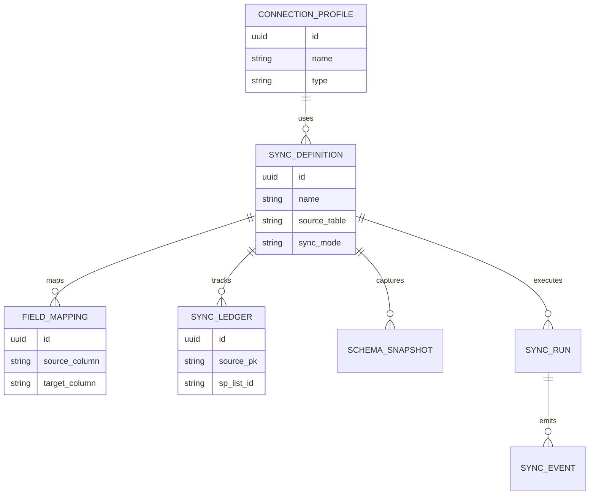

# Database Schema Visuals

## Meta-store ER Diagram

```mermaid
erDiagram
    CONNECTION_PROFILE ||--o{ SYNC_DEFINITION : uses
    SYNC_DEFINITION ||--o{ FIELD_MAPPING : maps
    SYNC_DEFINITION ||--o{ SYNC_LEDGER : tracks
    SYNC_DEFINITION ||--o{ SCHEMA_SNAPSHOT : captures
    SYNC_DEFINITION ||--o{ SYNC_RUN : executes
    SYNC_RUN ||--o{ SYNC_EVENT : emits

    CONNECTION_PROFILE {
        uuid id
        string name
        string type
    }
    SYNC_DEFINITION {
        uuid id
        string name
        string source_table
        string sync_mode
    }
    FIELD_MAPPING {
        uuid id
        string source_column
        string target_column
    }
    SYNC_LEDGER {
        uuid id
        string source_pk
        string sp_list_id
    }
```
