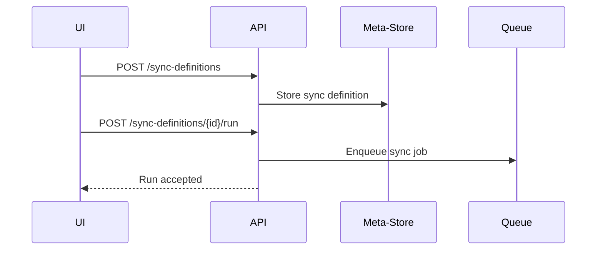

# API Interaction Diagram

```mermaid
sequenceDiagram
    participant UI
    participant API
    participant Meta as Meta-Store
    participant Queue

    UI->>API: POST /sync-definitions
    API->>Meta: Store sync definition
    UI->>API: POST /sync-definitions/{id}/run
    API->>Queue: Enqueue sync job
    API-->>UI: Run accepted
```
