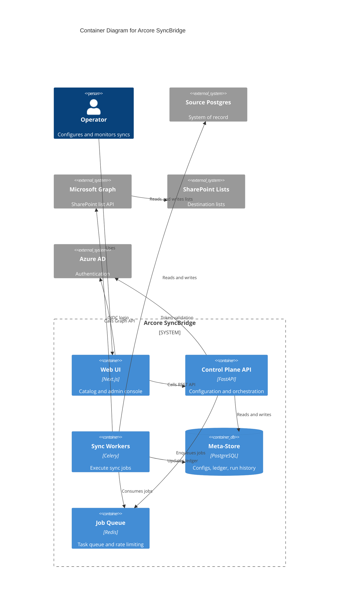

# Container Diagram (C4 Level 2)

```mermaid
C4Container
    title Container Diagram for Arcore SyncBridge

    Person(user, "Operator", "Configures and monitors syncs")

    System_Boundary(syncbridge, "Arcore SyncBridge") {
        Container(ui, "Web UI", "Next.js", "Catalog and admin console")
        Container(api, "Control Plane API", "FastAPI", "Configuration and orchestration")
        Container(worker, "Sync Workers", "Celery", "Execute sync jobs")
        ContainerDb(metastore, "Meta-Store", "PostgreSQL", "Configs, ledger, run history")
        Container(queue, "Job Queue", "Redis", "Task queue and rate limiting")
    }

    System_Ext(source, "Source Postgres", "System of record")
    System_Ext(graph, "Microsoft Graph", "SharePoint list API")
    System_Ext(sharepoint, "SharePoint Lists", "Destination lists")
    System_Ext(aad, "Azure AD", "Authentication")

    Rel(user, ui, "Uses")
    Rel(ui, api, "Calls REST API")
    Rel(api, metastore, "Reads and writes")
    Rel(api, queue, "Enqueues jobs")
    Rel(worker, queue, "Consumes jobs")
    Rel(worker, metastore, "Updates ledger")
    Rel(worker, source, "Reads and writes")
    Rel(worker, graph, "Calls Graph API")
    Rel(graph, sharepoint, "Reads and writes lists")
    Rel(ui, aad, "OIDC login")
    Rel(api, aad, "Token validation")
```
