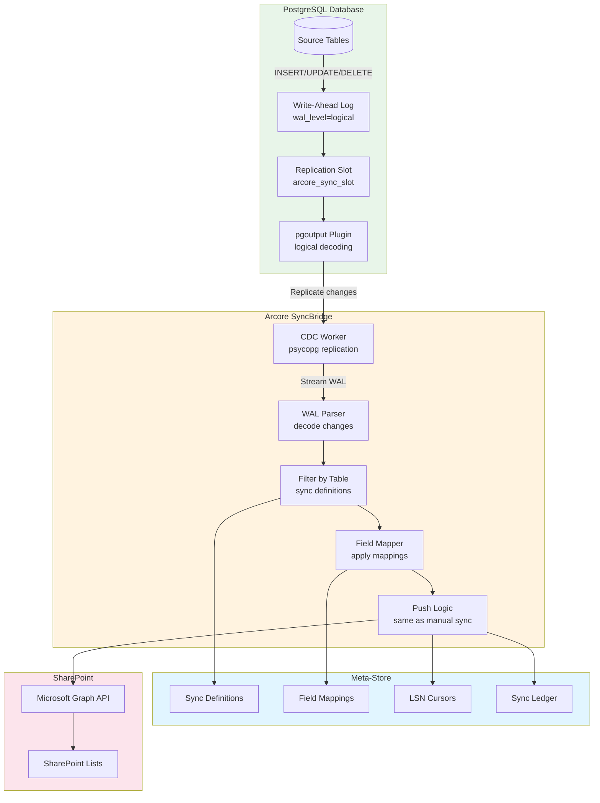
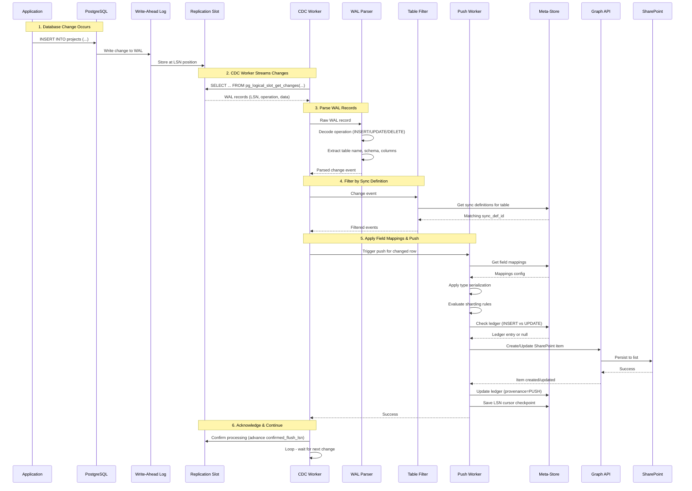
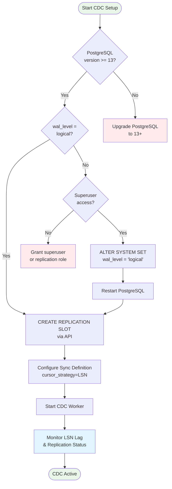
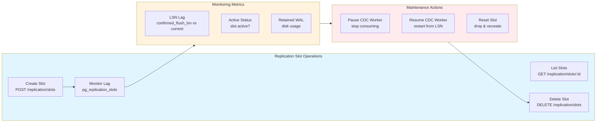
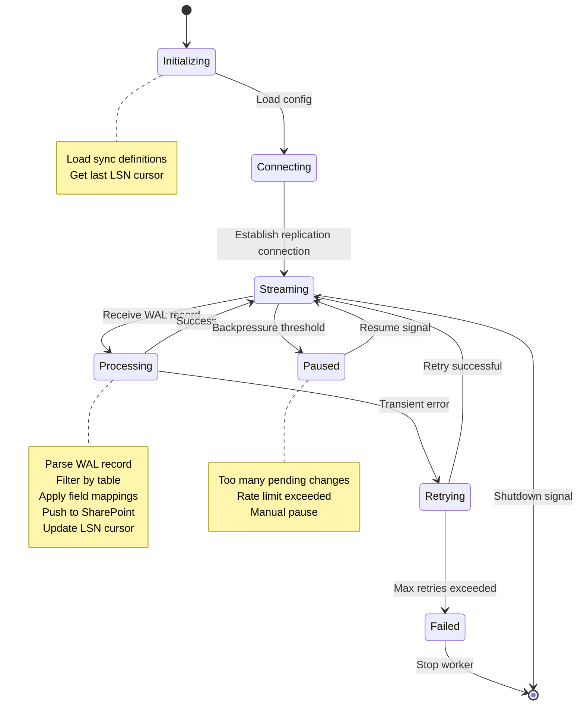
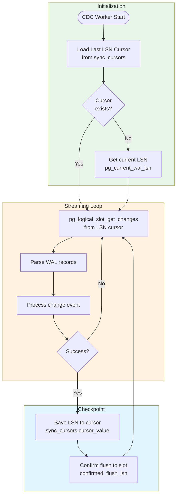
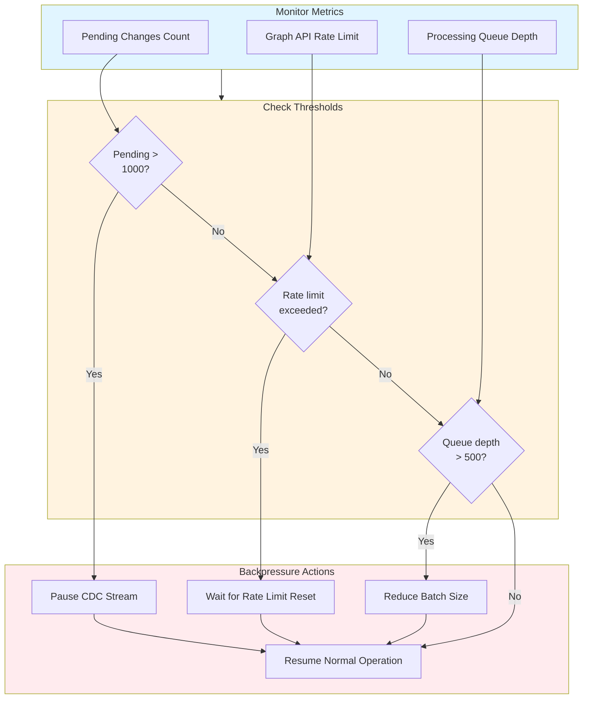

# CDC (Change Data Capture) Architecture

## Overview
Arcore SyncBridge implements real-time CDC using PostgreSQL logical replication with the `pgoutput` plugin. This provides near real-time synchronization of database changes to SharePoint.

## CDC Architecture Diagram



## CDC Flow - Detailed Sequence



## CDC Setup Process



## Replication Slot Management



## CDC Worker State Machine



## LSN Cursor Management



## Backpressure & Throttling



## Benefits of CDC over Polling

| Aspect | Polling (UPDATED_AT) | CDC (Logical Replication) |
|--------|---------------------|---------------------------|
| **Latency** | Minutes (batch interval) | Seconds (near real-time) |
| **Database Load** | Repeated full table scans | Stream WAL changes only |
| **Deleted Rows** | Not detected | Captured (DELETE events) |
| **Accuracy** | May miss concurrent updates | Guaranteed all changes |
| **Scalability** | Decreases with table size | Independent of table size |
| **Setup Complexity** | Simple (just add timestamp column) | Moderate (requires superuser, config) |

## Limitations & Considerations

### Performance
- **WAL Retention**: Unprocessed changes consume disk space
- **Replication Lag**: Monitor `confirmed_flush_lsn` vs `sent_lsn`
- **Slot Management**: Inactive slots prevent WAL cleanup

### Operational
- **Superuser Required**: Replication slot creation needs elevated privileges
- **PostgreSQL Restart**: Changing `wal_level` requires restart
- **Slot Cleanup**: Must manually drop slots to reclaim space

### Compatibility
- **PostgreSQL Version**: Requires 13+ for reliable pgoutput
- **AWS RDS**: Supported, use `rds.logical_replication = 1`
- **Azure PostgreSQL**: Supported, set replication support to LOGICAL

## Monitoring Queries

```sql
-- Check replication slot status
SELECT slot_name, active, restart_lsn, confirmed_flush_lsn,
       pg_size_pretty(pg_wal_lsn_diff(pg_current_wal_lsn(), restart_lsn)) AS retained_wal
FROM pg_replication_slots
WHERE slot_name = 'arcore_sync_slot';

-- Check replication lag
SELECT slot_name,
       pg_wal_lsn_diff(pg_current_wal_lsn(), confirmed_flush_lsn) AS lag_bytes
FROM pg_replication_slots
WHERE slot_name = 'arcore_sync_slot';

-- List available WAL files
SELECT * FROM pg_ls_waldir()
ORDER BY modification DESC
LIMIT 10;
```
