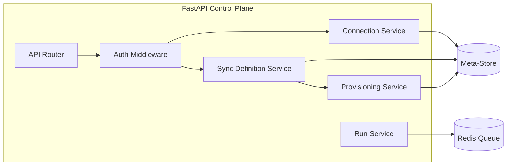

# Component Diagram (Control Plane API)

```mermaid
flowchart LR
    subgraph API[FastAPI Control Plane]
        Router[API Router]
        Auth[Auth Middleware]
        Conn[Connection Service]
        SyncDef[Sync Definition Service]
        Provision[Provisioning Service]
        Runs[Run Service]
    end

    Router --> Auth
    Auth --> Conn
    Auth --> SyncDef
    SyncDef --> Provision
    Runs --> Queue[(Redis Queue)]
    Conn --> Meta[(Meta-Store)]
    SyncDef --> Meta
    Provision --> Meta
```
