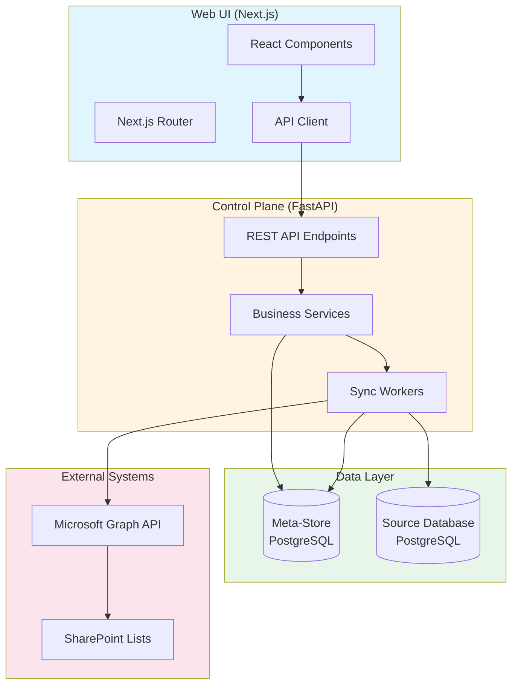
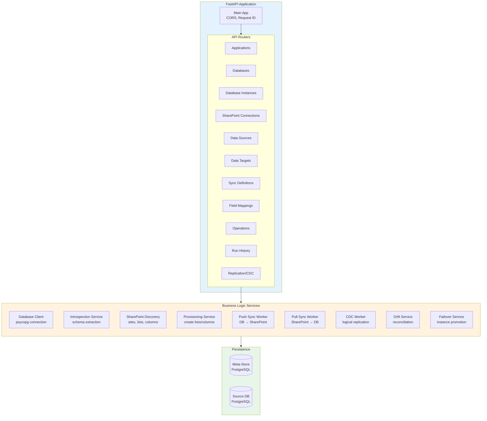
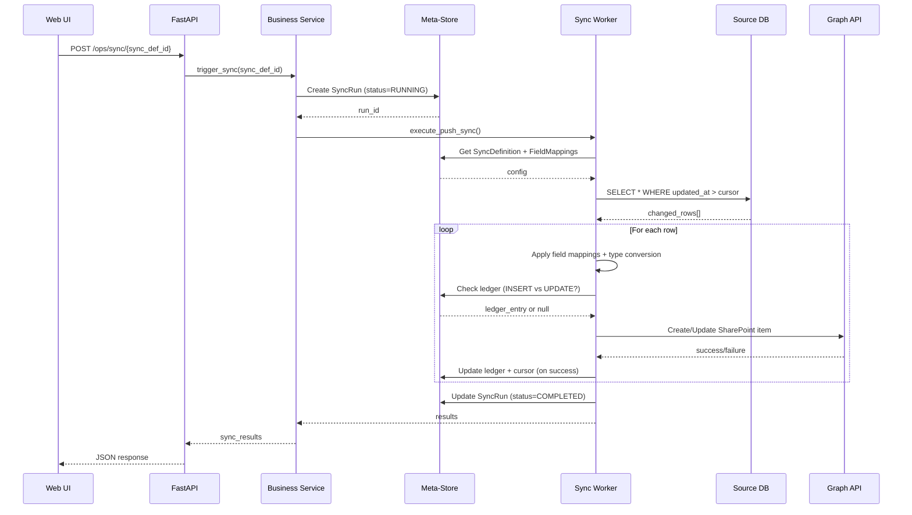

# Component Diagrams

## High-Level Architecture

```mermaid
flowchart TB
    subgraph Frontend["Web UI (Next.js)"]
        UI[React Components]
        Router[Next.js Router]
        API_Client[API Client]
    end

    subgraph Backend["Control Plane (FastAPI)"]
        direction TB
        API[REST API Endpoints]
        Services[Business Services]
        Workers[Sync Workers]
    end

    subgraph Storage["Data Layer"]
        Meta[(Meta-Store<br/>PostgreSQL)]
        Source[(Source Database<br/>PostgreSQL)]
    end

    subgraph External["External Systems"]
        Graph[Microsoft Graph API]
        SP[SharePoint Lists]
    end

    UI --> API_Client
    API_Client --> API
    API --> Services
    Services --> Meta
    Services --> Workers
    Workers --> Source
    Workers --> Graph
    Graph --> SP
    Workers --> Meta

    style Frontend fill:#e1f5ff
    style Backend fill:#fff4e1
    style Storage fill:#e8f5e9
    style External fill:#fce4ec
```

## Control Plane API Components

```mermaid
flowchart TB
    subgraph API["FastAPI Application"]
        direction TB
        Main[Main App<br/>CORS, Request ID]

        subgraph Routers["API Routers"]
            Apps[Applications]
            DBs[Databases]
            DBInst[Database Instances]
            SPConn[SharePoint Connections]
            DataSrc[Data Sources]
            DataTgt[Data Targets]
            SyncDefs[Sync Definitions]
            FieldMaps[Field Mappings]
            Ops[Operations]
            Runs[Run History]
            Replic[Replication/CDC]
        end

        Main --> Routers
    end

    subgraph Services["Business Logic Services"]
        direction TB
        DBClient[Database Client<br/>psycopg connection]
        Introspect[Introspection Service<br/>schema extraction]
        SPDiscovery[SharePoint Discovery<br/>sites, lists, columns]
        Provisioner[Provisioning Service<br/>create lists/columns]
        Pusher[Push Sync Worker<br/>DB → SharePoint]
        Synchronizer[Pull Sync Worker<br/>SharePoint → DB]
        CDCWorker[CDC Worker<br/>logical replication]
        DriftSvc[Drift Service<br/>reconciliation]
        FailoverSvc[Failover Service<br/>instance promotion]
    end

    subgraph Storage["Persistence"]
        Meta[(Meta-Store<br/>PostgreSQL)]
        Source[(Source DB<br/>PostgreSQL)]
    end

    Routers --> Services
    Services --> Storage

    style API fill:#e3f2fd
    style Services fill:#fff3e0
    style Storage fill:#e8f5e9
```

## Sync Worker Architecture

```mermaid
flowchart TB
    subgraph Workers["Sync Workers"]
        direction LR

        subgraph Push["Push Worker (DB → SP)"]
            P1[Fetch Changed Rows<br/>via cursor]
            P2[Apply Field Mappings<br/>directional filtering]
            P3[Type Serialization<br/>datetime, Decimal, UUID]
            P4[Evaluate Sharding<br/>conditional routing]
            P5[Check Ledger<br/>INSERT vs UPDATE]
            P6[Call Graph API<br/>create/update item]
            P7[Update Ledger<br/>hash, provenance=PUSH]
            P8[Advance Cursor<br/>only on success]

            P1 --> P2 --> P3 --> P4 --> P5 --> P6 --> P7 --> P8
        end

        subgraph Pull["Pull Worker (SP → DB)"]
            I1[Call Delta Query<br/>fetch changes]
            I2[Apply Field Mappings<br/>directional filtering]
            I3[Check Ledger<br/>conflict detection]
            I4[Apply Conflict Policy<br/>SOURCE/DEST/LATEST_WINS]
            I5[Update Database<br/>INSERT/UPDATE]
            I6[Update Ledger<br/>hash, provenance=PULL]
            I7[Save Delta Token<br/>cursor update]

            I1 --> I2 --> I3 --> I4 --> I5 --> I6 --> I7
        end

        subgraph CDC["CDC Worker (Real-Time)"]
            C1[Stream WAL Changes<br/>logical replication]
            C2[Filter by Table<br/>sync definition]
            C3[Parse LSN & Data<br/>extract changes]
            C4[Apply to Push Logic<br/>same as push worker]
            C5[Update LSN Cursor<br/>checkpoint]

            C1 --> C2 --> C3 --> C4 --> C5
        end
    end

    subgraph Data["Data Stores"]
        Meta[(Meta-Store)]
        SourceDB[(Source DB)]
        Graph[Graph API]
    end

    Push --> Meta
    Push --> SourceDB
    Push --> Graph
    Pull --> Meta
    Pull --> SourceDB
    Pull --> Graph
    CDC --> Meta
    CDC --> SourceDB

    style Push fill:#e8f5e9
    style Pull fill:#e1f5ff
    style CDC fill:#fff3e0
    style Data fill:#fce4ec
```

## Field Mapping & Type Conversion Flow

```mermaid
flowchart LR
    subgraph Source["Database Row"]
        S1[project_code: 'PRJ-001']
        S2[budget: Decimal'450000.00']
        S3[start_date: date'2025-11-06']
        S4[updated_at: datetime]
    end

    subgraph Mapping["Field Mapping Engine"]
        M1[Filter by Direction<br/>BIDIRECTIONAL/PUSH_ONLY]
        M2[Type Serialization<br/>Python → JSON]
        M3[Apply Transformations<br/>optional]
    end

    subgraph Target["SharePoint Item"]
        T1[Title: 'PRJ-001']
        T2[BudgetAmount: 450000.0]
        T3[StartDate: '2025-11-06T00:00:00']
        T4[Modified: '2025-01-03T12:00:00']
    end

    Source --> M1
    M1 --> M2
    M2 --> M3
    M3 --> Target

    style Source fill:#e8f5e9
    style Mapping fill:#fff3e0
    style Target fill:#e1f5ff
```

## Data Flow - Request Lifecycle

```mermaid
sequenceDiagram
    participant UI as Web UI
    participant API as FastAPI
    participant Service as Business Service
    participant Meta as Meta-Store
    participant Worker as Sync Worker
    participant Source as Source DB
    participant Graph as Graph API

    UI->>API: POST /ops/sync/{sync_def_id}
    API->>Service: trigger_sync(sync_def_id)

    Service->>Meta: Create SyncRun (status=RUNNING)
    Meta-->>Service: run_id

    Service->>Worker: execute_push_sync()

    Worker->>Meta: Get SyncDefinition + FieldMappings
    Meta-->>Worker: config

    Worker->>Source: SELECT * WHERE updated_at > cursor
    Source-->>Worker: changed_rows[]

    loop For each row
        Worker->>Worker: Apply field mappings + type conversion
        Worker->>Meta: Check ledger (INSERT vs UPDATE?)
        Meta-->>Worker: ledger_entry or null
        Worker->>Graph: Create/Update SharePoint item
        Graph-->>Worker: success/failure
        Worker->>Meta: Update ledger + cursor (on success)
    end

    Worker->>Meta: Update SyncRun (status=COMPLETED)
    Worker-->>Service: results
    Service-->>API: sync_results
    API-->>UI: JSON response
```
