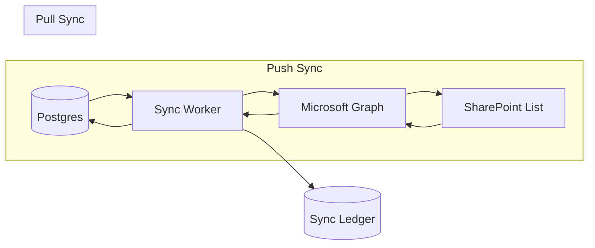

# Data Flow Diagram

```mermaid
graph LR
    subgraph Push Sync
        PG[(Postgres)] --> Worker[Sync Worker]
        Worker --> Graph[Microsoft Graph]
        Graph --> SP[SharePoint List]
    end

    subgraph Pull Sync
        SP --> Graph
        Graph --> Worker
        Worker --> PG
    end

    Worker --> Ledger[(Sync Ledger)]
```
