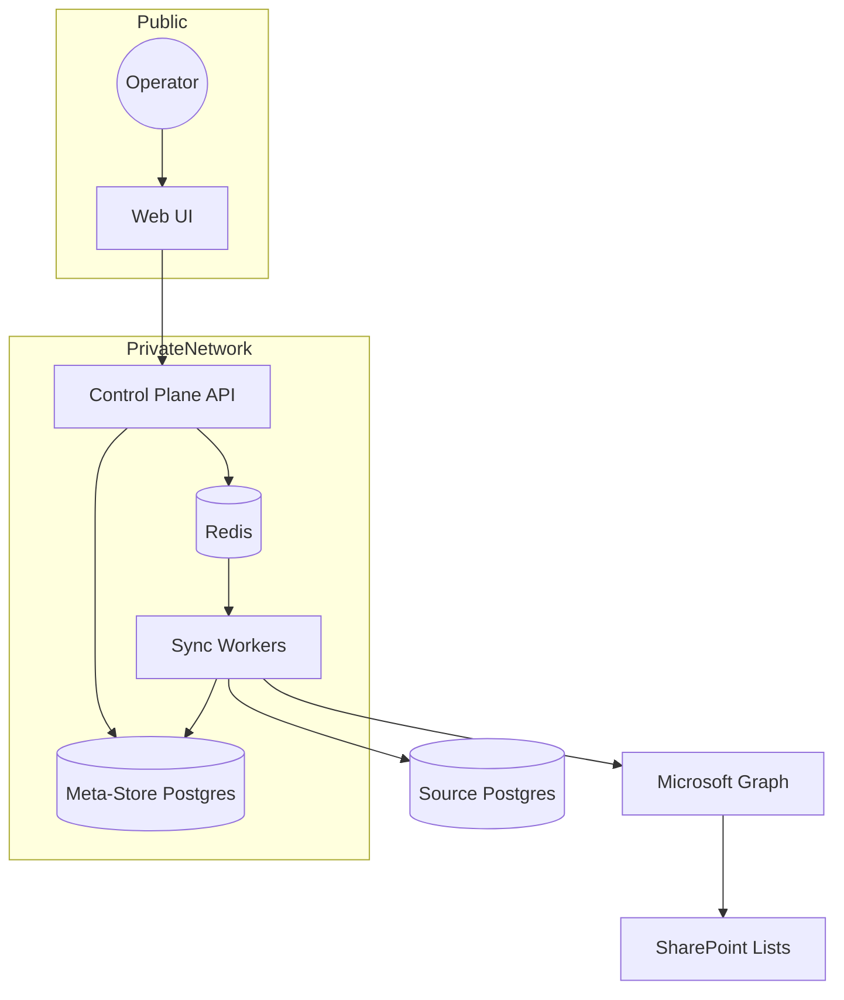

# Deployment Diagram

```mermaid
graph TD
    subgraph Public
        User((Operator)) --> UI[Web UI]
    end

    subgraph PrivateNetwork
        UI --> API[Control Plane API]
        API --> Queue[(Redis)]
        API --> Meta[(Meta-Store Postgres)]
        Queue --> Worker[Sync Workers]
        Worker --> Meta
    end

    Worker --> Source[(Source Postgres)]
    Worker --> Graph[Microsoft Graph]
    Graph --> SP[SharePoint Lists]
```
