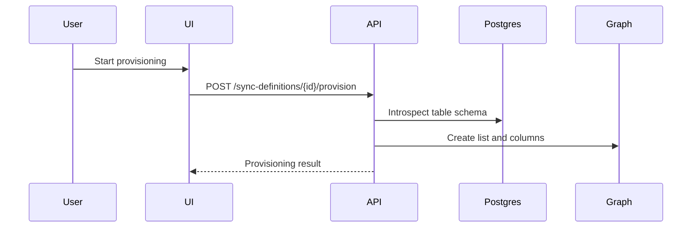

# Sequence Diagram: Provisioning

```mermaid
sequenceDiagram
    participant User
    participant UI
    participant API
    participant PG as Postgres
    participant Graph

    User->>UI: Start provisioning
    UI->>API: POST /sync-definitions/{id}/provision
    API->>PG: Introspect table schema
    API->>Graph: Create list and columns
    API-->>UI: Provisioning result
```
