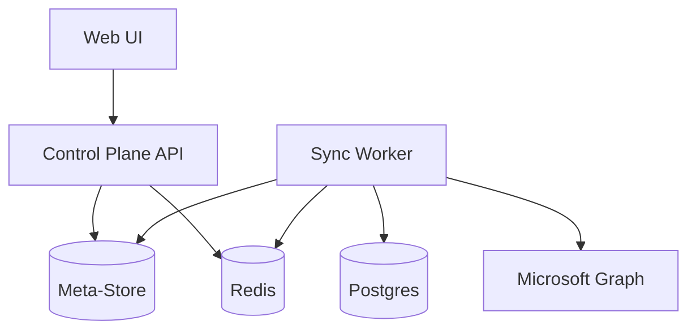

# Service Dependency Graph

```mermaid
graph TD
    UI[Web UI] --> API[Control Plane API]
    API --> Meta[(Meta-Store)]
    API --> Queue[(Redis)]
    Worker[Sync Worker] --> Queue
    Worker --> Meta
    Worker --> Source[(Postgres)]
    Worker --> Graph[Microsoft Graph]
```
