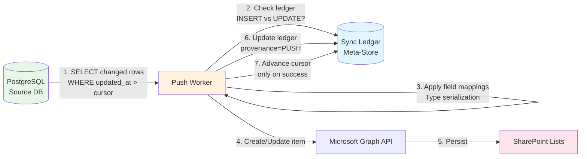
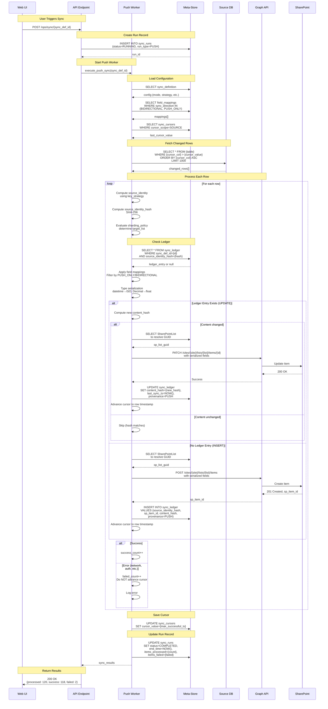
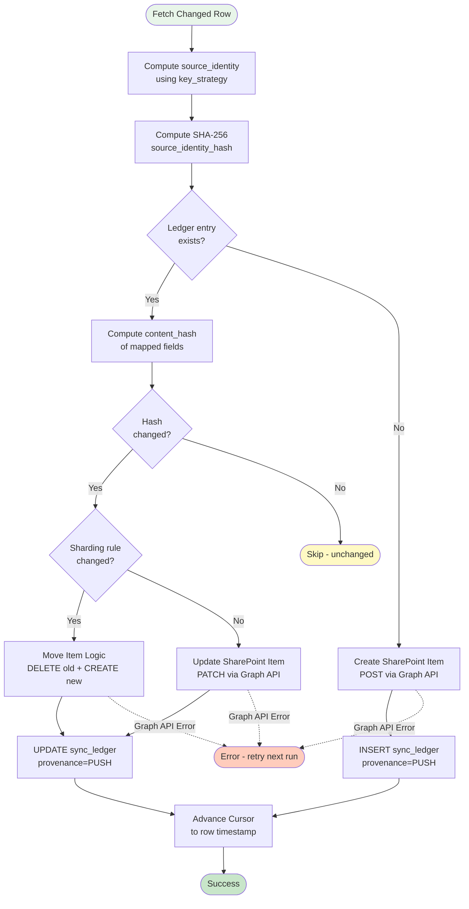
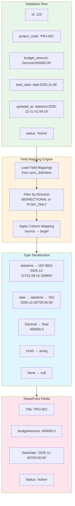
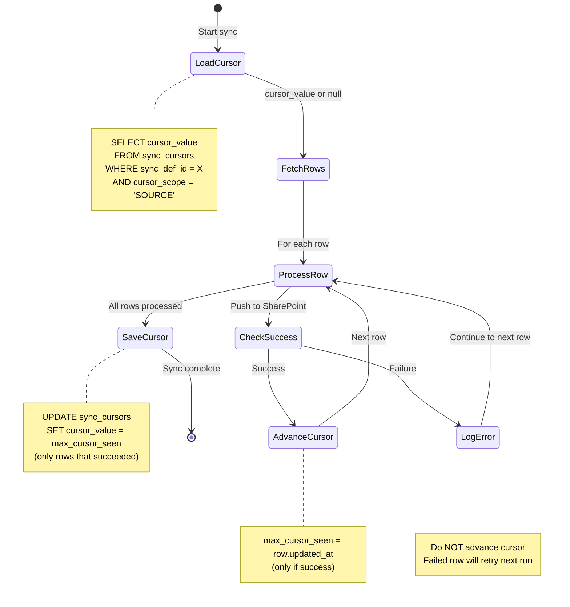
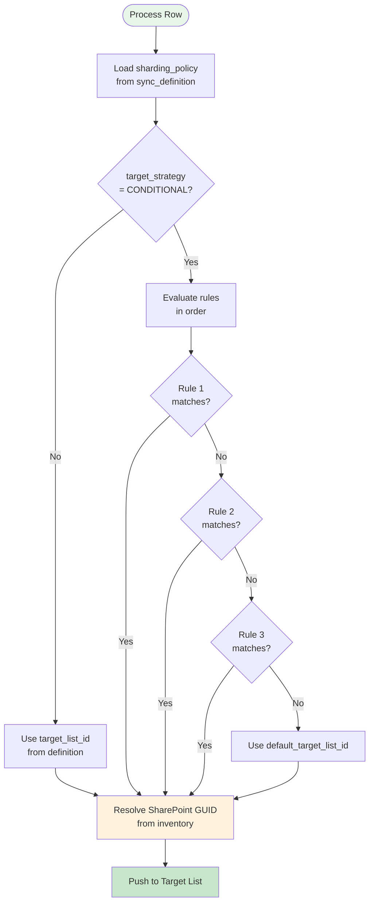
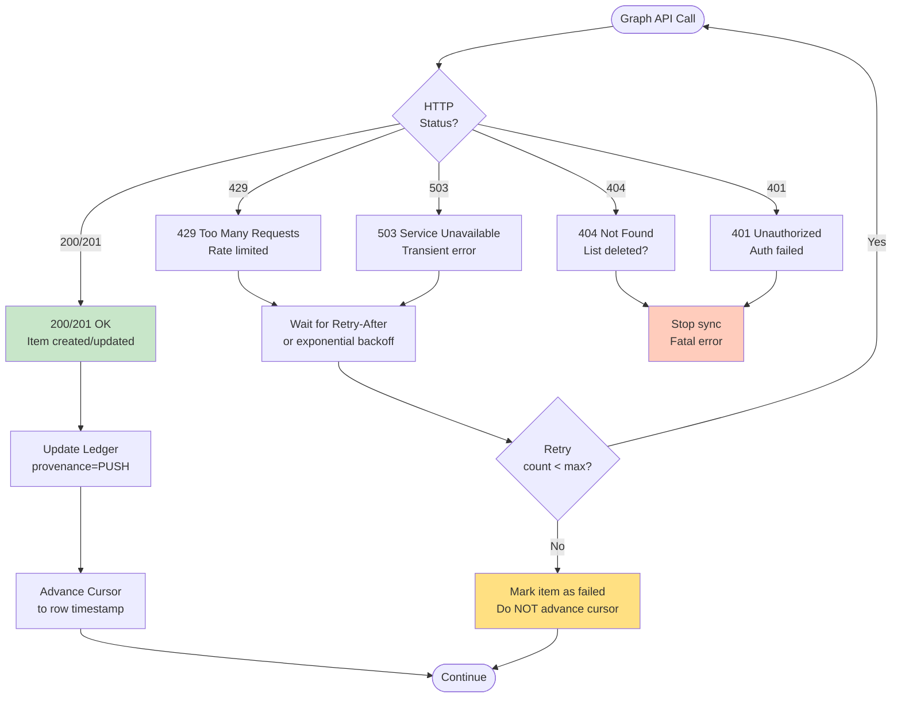
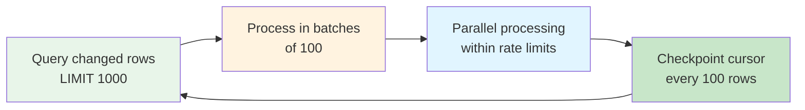
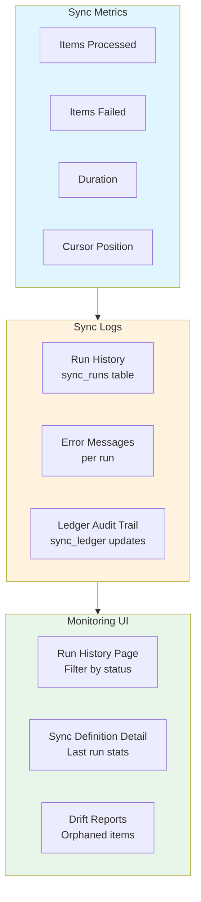

# One-Way Sync Flow (Push: Database → SharePoint)

## Overview
One-way push sync reads changed rows from PostgreSQL and synchronizes them to SharePoint lists. This is the most common sync mode for use cases where the database is the authoritative source.

## High-Level One-Way Sync Flow



## Detailed Push Sync Sequence



## Push Sync Decision Tree



## Field Mapping & Type Serialization Pipeline



## Cursor Management & Failure Recovery



## Sharding Logic - Multi-List Routing



## Example Sharding Configuration

```json
{
  "sync_definition": {
    "id": "uuid",
    "name": "Projects Sync",
    "target_strategy": "CONDITIONAL",
    "sharding_policy": {
      "rules": [
        {
          "if": "status == 'Active'",
          "target_list_id": "active-list-uuid"
        },
        {
          "if": "status == 'Closed'",
          "target_list_id": "closed-list-uuid"
        },
        {
          "if": "budget_amount >= 1000000",
          "target_list_id": "large-projects-uuid"
        }
      ],
      "default_target_list_id": "active-list-uuid"
    }
  }
}
```

## Error Handling & Retry Strategy



## Performance Optimization

### Batching Strategy


### Rate Limiting
- **Graph API Limits**: 10,000 requests per 10 minutes per tenant
- **Per-List Limits**: 500 item operations per 10 seconds
- **Mitigation**: Sequential processing per list, respect Retry-After headers

### Cursor Strategy
- **UPDATED_AT**: Use timestamp column for incremental queries
- **LSN**: Use logical sequence number for CDC (see CDC diagram)
- **FULL_SCAN**: No cursor, process all rows each time (not recommended for large tables)

## Monitoring & Observability


