# Two-Way Sync Flow (Bidirectional: Database ↔ SharePoint)

## Overview
Two-way sync provides bidirectional synchronization where changes can originate from either PostgreSQL or SharePoint. The system uses ledger provenance tracking and conflict resolution policies to handle simultaneous changes.

## High-Level Two-Way Sync Flow

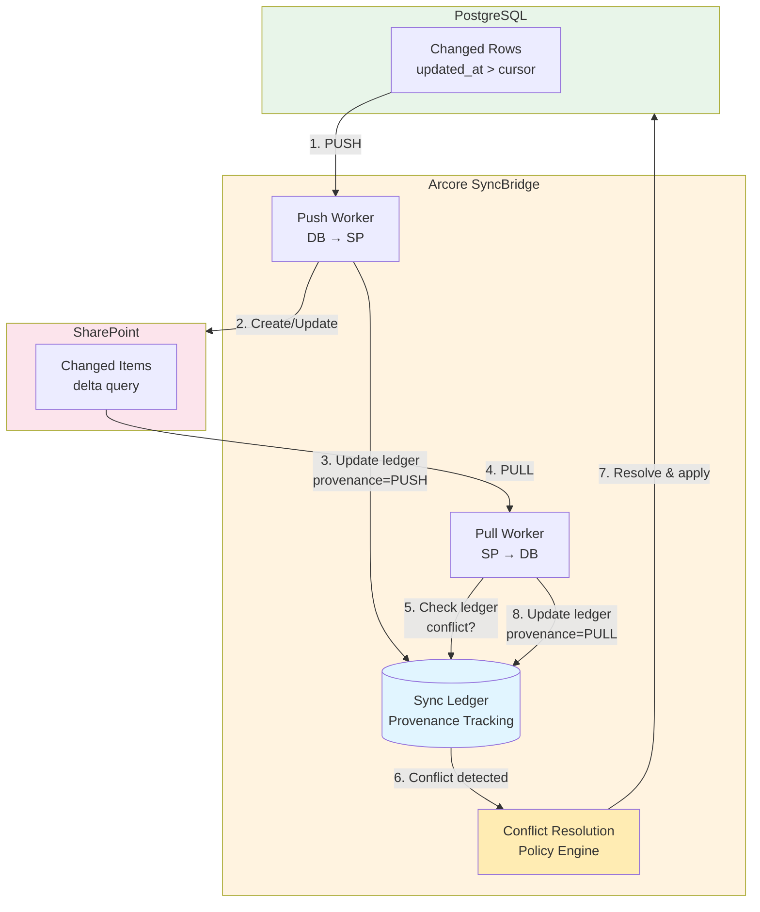

## Complete Two-Way Sync Sequence

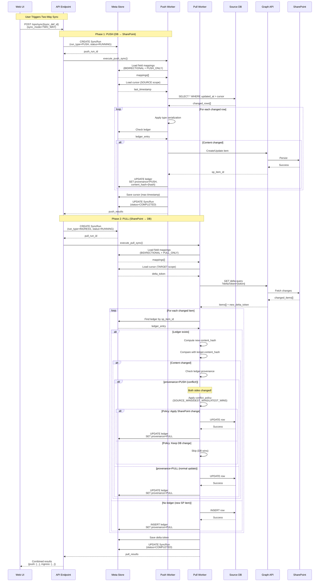

## Conflict Detection & Resolution

```mermaid
flowchart TB
    Start([Pull finds SharePoint change])
    LoadLedger[Load ledger entry<br/>by sp_item_id]
    LedgerExists{Ledger<br/>exists?}

    ComputeHash[Compute content_hash<br/>of SharePoint item]
    CompareHash{Hash changed<br/>since last sync?}

    CheckProvenance{ledger.provenance<br/>= PUSH?}

    NoConflict[Normal Update<br/>No conflict]
    Conflict[Conflict Detected!<br/>Both sides changed]

    LoadPolicy[Load conflict_policy<br/>from sync_definition]
    ApplyPolicy{Conflict<br/>Policy?}

    SourceWins[SOURCE_WINS<br/>Keep DB change,<br/>skip SharePoint update]
    DestWins[DESTINATION_WINS<br/>Apply SharePoint change<br/>to DB]
    LatestWins[LATEST_WINS<br/>Compare timestamps]
    CompareTS{SharePoint Modified<br/>> DB updated_at?}

    ApplyToDB[UPDATE database row]
    UpdateLedger[UPDATE ledger<br/>provenance=PULL]
    Skip[Skip - DB wins]
    Done([Continue])

    Start --> LoadLedger
    LoadLedger --> LedgerExists

    LedgerExists -->|No| ApplyToDB
    LedgerExists -->|Yes| ComputeHash

    ComputeHash --> CompareHash
    CompareHash -->|No| Skip
    CompareHash -->|Yes| CheckProvenance

    CheckProvenance -->|No (PULL)| NoConflict
    CheckProvenance -->|Yes (PUSH)| Conflict

    NoConflict --> ApplyToDB
    Conflict --> LoadPolicy
    LoadPolicy --> ApplyPolicy

    ApplyPolicy -->|SOURCE_WINS| SourceWins
    ApplyPolicy -->|DESTINATION_WINS| DestWins
    ApplyPolicy -->|LATEST_WINS| LatestWins

    LatestWins --> CompareTS
    CompareTS -->|Yes| DestWins
    CompareTS -->|No| SourceWins

    SourceWins --> Skip
    DestWins --> ApplyToDB

    ApplyToDB --> UpdateLedger
    UpdateLedger --> Done
    Skip --> Done

    style Start fill:#e8f5e9
    style Conflict fill:#ffccbc
    style NoConflict fill:#c8e6c9
    style Done fill:#e8f5e9
```

## Loop Prevention Mechanism

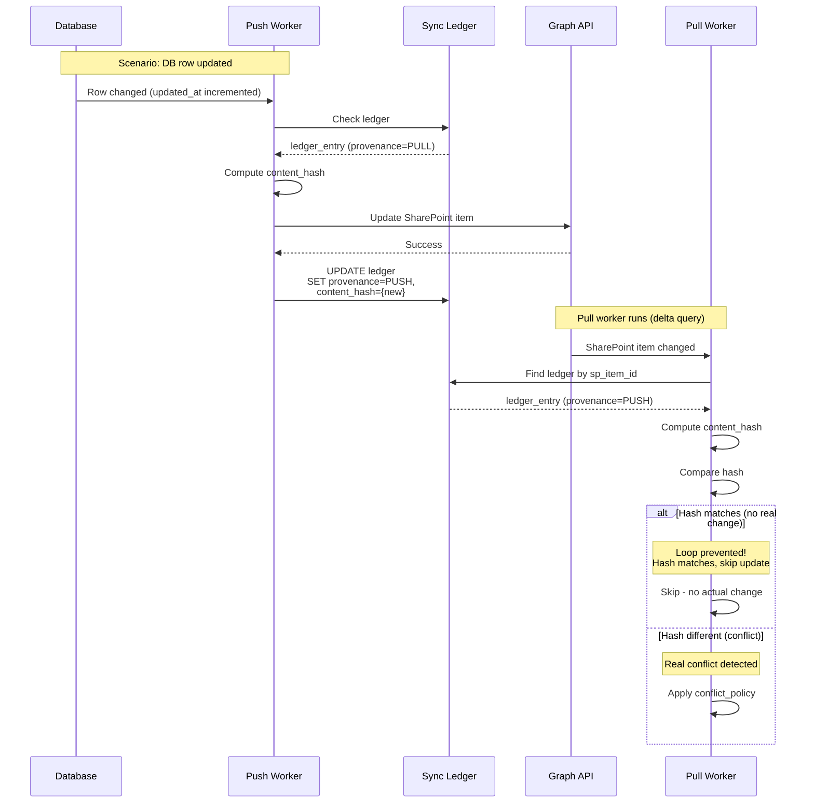

## Provenance State Machine

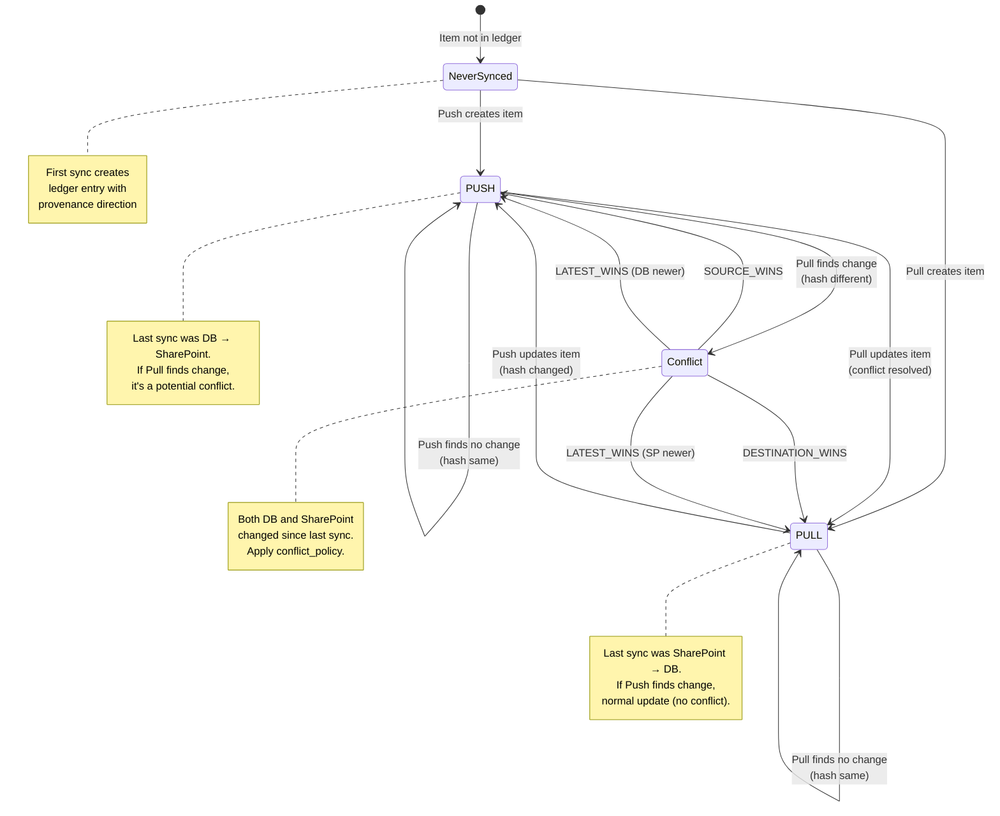

## Field Mapping Directional Filtering

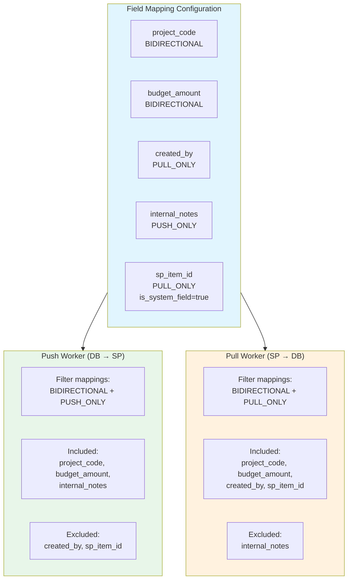

## Conflict Resolution Policies

### SOURCE_WINS Policy
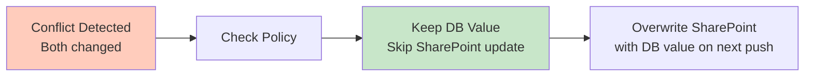

### DESTINATION_WINS Policy
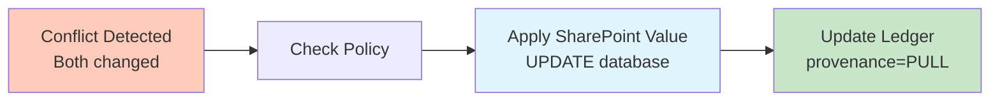

### LATEST_WINS Policy
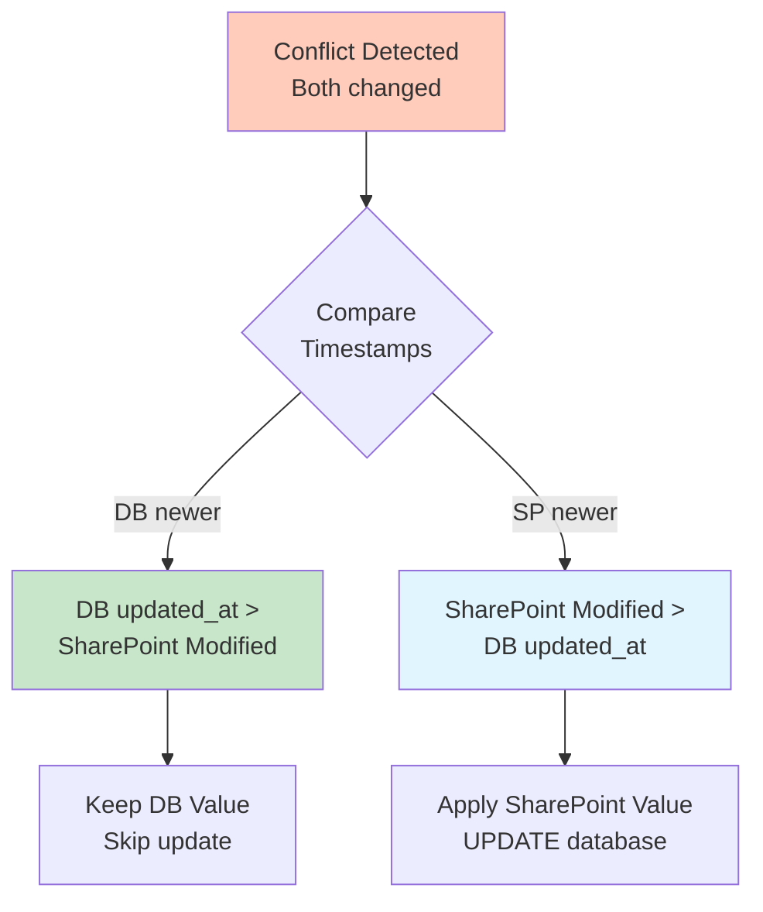

## Delta Query for Pull Sync

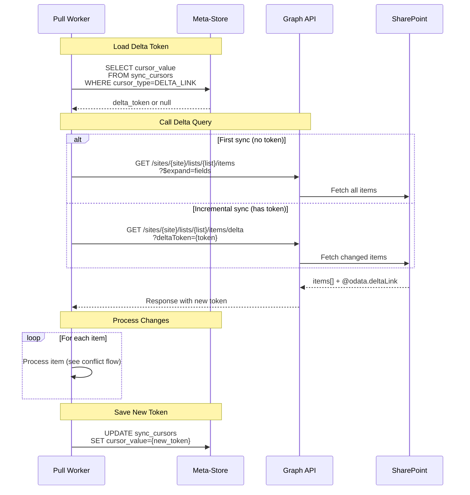

## Complete Two-Way Sync State Flow

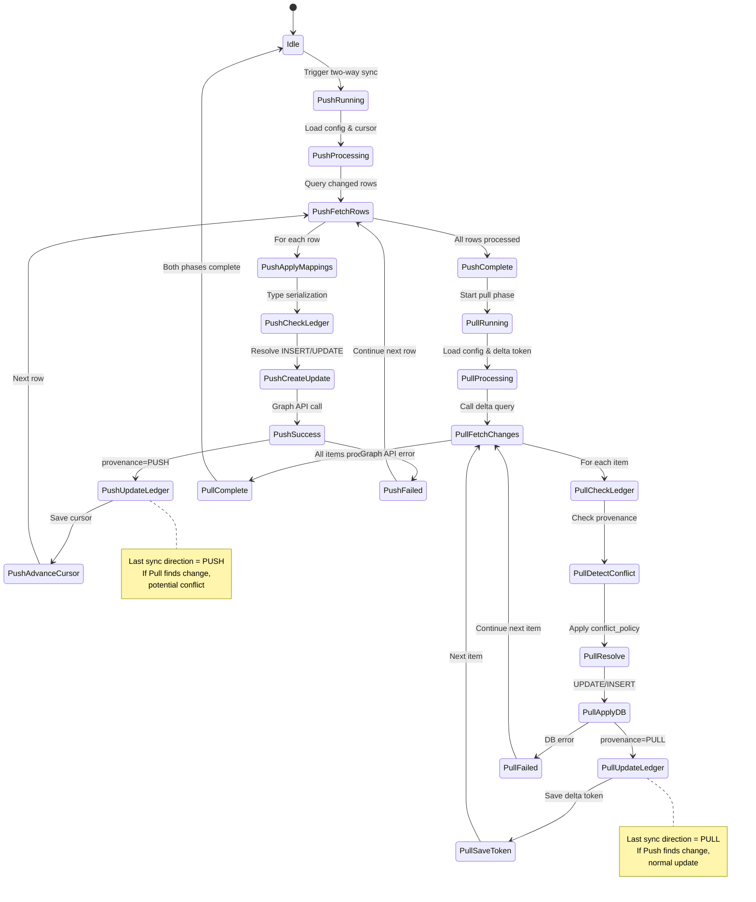

## Example Two-Way Sync Scenario

### Scenario: Concurrent Updates

**Initial State:**
- DB: `budget_amount = 100000`, `updated_at = '2025-01-01 10:00:00'`
- SharePoint: `BudgetAmount = 100000`, `Modified = '2025-01-01 10:00:00'`
- Ledger: `content_hash = 'abc123'`, `provenance = PUSH`

**Step 1: User updates DB**
- DB: `budget_amount = 150000`, `updated_at = '2025-01-02 09:00:00'`

**Step 2: User updates SharePoint (before push sync runs)**
- SharePoint: `BudgetAmount = 200000`, `Modified = '2025-01-02 09:30:00'`

**Step 3: Push sync runs**
- Fetches DB row with budget=150000
- Checks ledger (provenance=PUSH, hash=abc123)
- Computes new hash (def456)
- Updates SharePoint BudgetAmount=150000
- Updates ledger (provenance=PUSH, hash=def456)

**Step 4: Pull sync runs**
- Fetches SharePoint changes via delta (BudgetAmount=150000)
- Wait... Modified timestamp is NEWER than our push!
- **Conflict Detected**: ledger.provenance=PUSH but SharePoint value differs from what we just pushed
- Apply conflict_policy (e.g., LATEST_WINS)
- If LATEST_WINS: Compare timestamps
  - SharePoint Modified (09:30) > DB updated_at (09:00)
  - Apply SharePoint value: UPDATE DB SET budget_amount=200000
  - BUT WAIT: We just pushed 150000 at 09:45!
  - Ledger shows our push was after SharePoint change
  - **No conflict** - hash matches our last push

This demonstrates the importance of content hashing in addition to timestamps.

## Monitoring Two-Way Sync

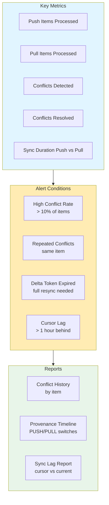

## Best Practices

### When to Use Two-Way Sync
✅ **Good Use Cases:**
- Collaboration: SharePoint users need to edit data, DB users need to see changes
- Mobile/offline scenarios: SharePoint provides mobile UI
- Approval workflows: SharePoint workflows trigger DB updates

❌ **Avoid When:**
- Database is single source of truth
- SharePoint is read-only reporting
- Complex DB triggers/constraints that would break from SP updates
- High-frequency updates (use CDC + one-way instead)

### Conflict Prevention Strategies
1. **Use PULL_ONLY for SharePoint fields**: Let users edit in SharePoint, never overwrite from DB
2. **Use PUSH_ONLY for calculated fields**: DB-managed fields never change in SharePoint
3. **Schedule push before pull**: Ensures DB changes take precedence
4. **Monitor conflict rate**: High rate indicates users editing both systems

### Field Mapping Recommendations
- **BIDIRECTIONAL**: Core business fields editable in both systems
- **PUSH_ONLY**: Calculated fields, DB-generated IDs, audit timestamps
- **PULL_ONLY**: SharePoint system fields (ID, Created, Modified), user-entered notes
