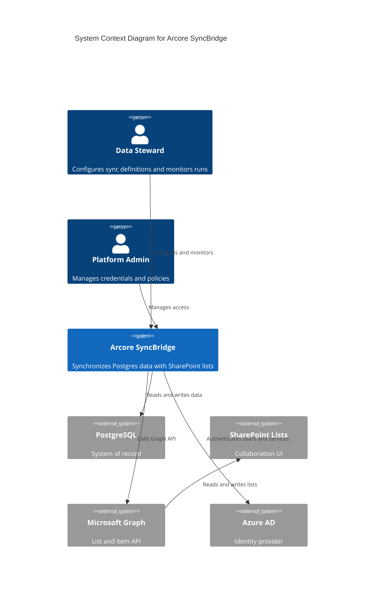

# System Context Diagram (C4 Level 1)

```mermaid
C4Context
    title System Context Diagram for Arcore SyncBridge

    Person(operator, "Data Steward", "Configures sync definitions and monitors runs")
    Person(admin, "Platform Admin", "Manages credentials and policies")

    System(syncbridge, "Arcore SyncBridge", "Synchronizes Postgres data with SharePoint lists")

    System_Ext(postgres, "PostgreSQL", "System of record")
    System_Ext(sharepoint, "SharePoint Lists", "Collaboration UI")
    System_Ext(graph, "Microsoft Graph", "List and item API")
    System_Ext(aad, "Azure AD", "Identity provider")

    Rel(operator, syncbridge, "Configures and monitors")
    Rel(admin, syncbridge, "Manages access")
    Rel(syncbridge, postgres, "Reads and writes data")
    Rel(syncbridge, graph, "Calls Graph API")
    Rel(graph, sharepoint, "Reads and writes lists")
    Rel(syncbridge, aad, "Authenticates users and services")
```
