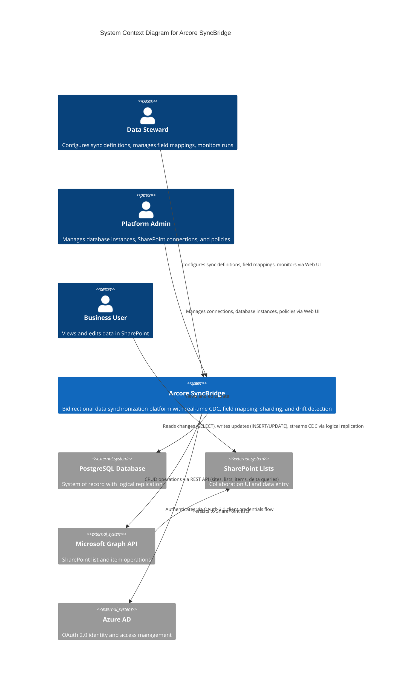

# System Context Diagram (C4 Level 1)

## Overview
Arcore SyncBridge provides bidirectional synchronization between PostgreSQL databases and SharePoint lists with real-time CDC capabilities.

## External Systems

### PostgreSQL Database
- **Role**: System of record (authoritative source)
- **Access**: Read-only for sync (SELECT), write access for bidirectional sync (INSERT/UPDATE)
- **CDC**: Logical replication via pgoutput plugin for real-time streaming
- **Requirements**: PostgreSQL 13+, wal_level=logical, replication slot

### Microsoft Graph API
- **Role**: SharePoint access layer
- **Operations**:
  - Sites: List and resolve SharePoint sites
  - Lists: Create, read, update list metadata
  - Items: CRUD operations on list items
  - Delta: Incremental change tracking via delta tokens
- **Authentication**: OAuth 2.0 client credentials
- **Rate Limits**: 10,000 requests per 10 minutes per tenant

### SharePoint Lists
- **Role**: Collaboration and data entry interface
- **Access**: Via Microsoft Graph API
- **Features**: Rich field types, versioning, permissions, workflows

### Azure AD
- **Role**: Identity provider and access control
- **Flow**: OAuth 2.0 client credentials flow
- **Requirements**: App registration with Sites.ReadWrite.All permission
