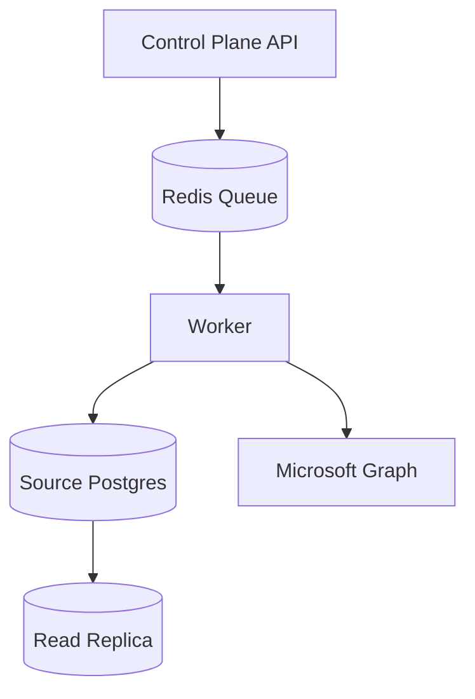

# Fault Tolerance and Failover

Arcore SyncBridge uses idempotent operations and durable state to recover from failures.

## Resilience tactics
- Retry transient Graph and network failures with exponential backoff.
- Use the sync ledger to prevent duplicate writes.
- Store configuration and run history in Postgres with backups.
- Keep workers stateless so they can be replaced safely.

