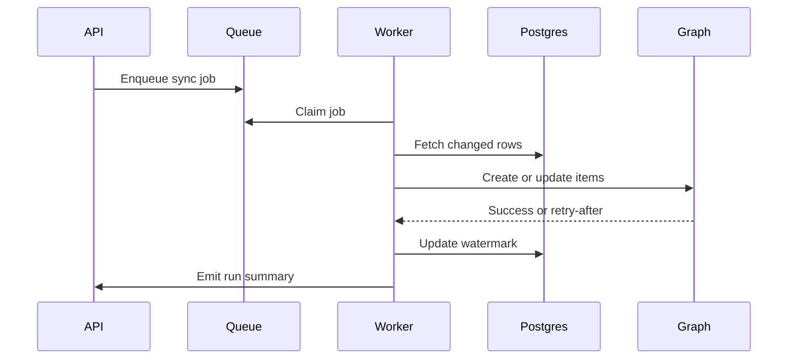

# Runtime Interaction and Resilience

```mermaid
sequenceDiagram
    participant API
    participant Queue
    participant Worker
    participant Source as Postgres
    participant Graph

    API->>Queue: Enqueue sync job
    Worker->>Queue: Claim job
    Worker->>Source: Fetch changed rows
    Worker->>Graph: Create or update items
    Graph-->>Worker: Success or retry-after
    Worker->>Source: Update watermark
    Worker->>API: Emit run summary
```

Workers honor Retry-After and retry with backoff. Each successful write updates the sync ledger for idempotency.
