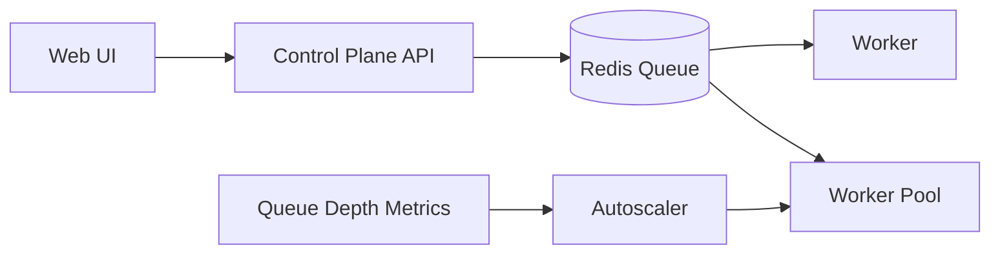

# Scaling Strategy

```mermaid
graph LR
    UI[Web UI] --> API[Control Plane API]
    API --> Queue[(Redis Queue)]
    Queue --> Worker1[Worker]
    Queue --> WorkerN[Worker Pool]
    Metrics[Queue Depth Metrics] --> Autoscaler[Autoscaler]
    Autoscaler --> WorkerN
```

Scaling is driven by queue depth and Graph API rate limits. Workers can be scaled horizontally without changing the control plane.
