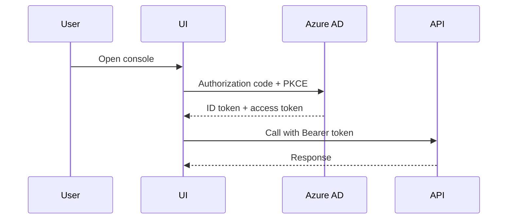
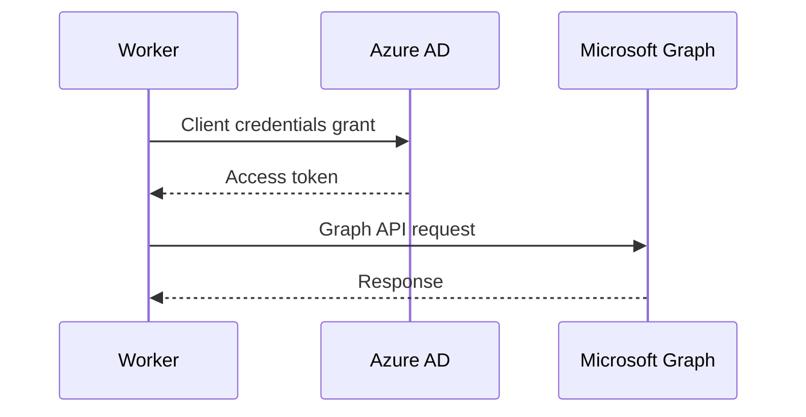

# Authentication and Authorization Flows

## UI login (OIDC + PKCE)

```mermaid
sequenceDiagram
    participant User
    participant UI
    participant AAD as Azure AD
    participant API

    User->>UI: Open console
    UI->>AAD: Authorization code + PKCE
    AAD-->>UI: ID token + access token
    UI->>API: Call with Bearer token
    API-->>UI: Response
```

## Worker access to Microsoft Graph (client credentials)

```mermaid
sequenceDiagram
    participant Worker
    participant AAD as Azure AD
    participant Graph as Microsoft Graph

    Worker->>AAD: Client credentials grant
    AAD-->>Worker: Access token
    Worker->>Graph: Graph API request
    Graph-->>Worker: Response
```
