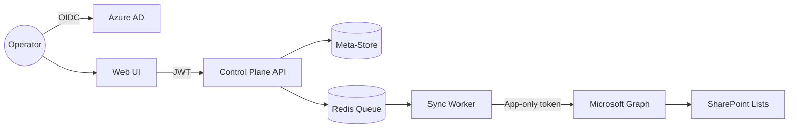

# Zero Trust Architecture

Arcore SyncBridge follows zero trust principles: verify explicitly, use least privilege, and assume breach.

## Core practices
- All users authenticate via Azure AD (OIDC).
- API validates JWT tokens and scopes on every request.
- Workers use app-only tokens with restricted Graph scopes.
- Secrets are encrypted at rest and rotated on schedule.

