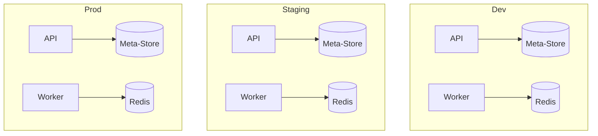

# Environment Topology

```mermaid
graph TD
    subgraph Dev
        DevAPI[API] --> DevDB[(Meta-Store)]
        DevWorker[Worker] --> DevQueue[(Redis)]
    end

    subgraph Staging
        StgAPI[API] --> StgDB[(Meta-Store)]
        StgWorker[Worker] --> StgQueue[(Redis)]
    end

    subgraph Prod
        ProdAPI[API] --> ProdDB[(Meta-Store)]
        ProdWorker[Worker] --> ProdQueue[(Redis)]
    end
```
