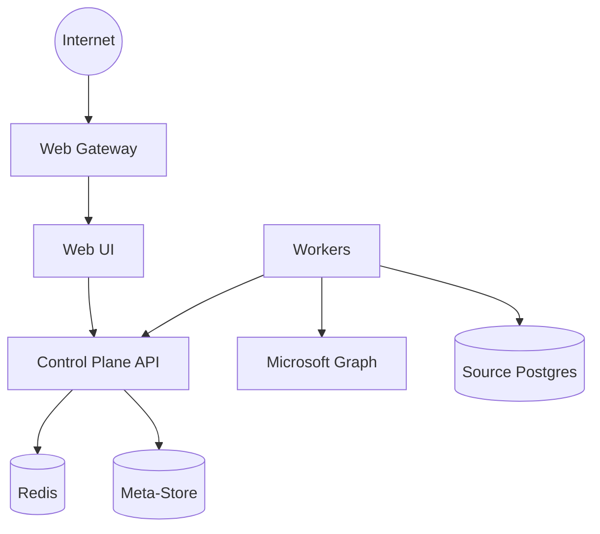

# Network Trust Boundaries

```mermaid
graph TD
    Internet((Internet)) --> WAF[Web Gateway]
    WAF --> UI[Web UI]
    UI --> API[Control Plane API]
    API --> Queue[(Redis)]
    API --> Meta[(Meta-Store)]
    Worker[Workers] --> API
    Worker --> Graph[Microsoft Graph]
    Worker --> Source[(Source Postgres)]
```
