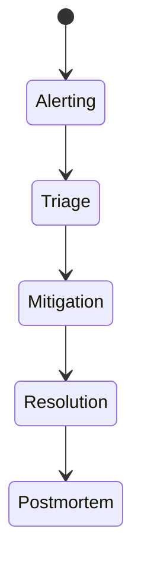

# Incident Response Flow

## Steps
1. Detect alert via monitoring or user report.
2. Triage severity and scope.
3. Mitigate by pausing affected sync definitions.
4. Resolve root cause.
5. Backfill or re-run sync if required.
6. Document post-incident review.

