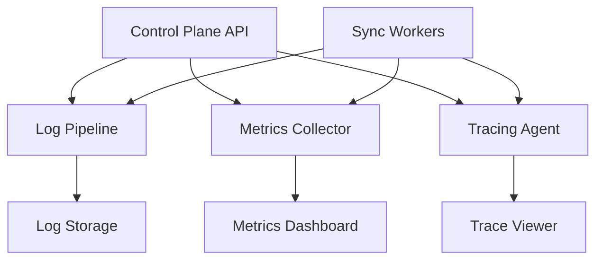

# Observability Architecture

```mermaid
graph TD
    API[Control Plane API] --> Logs[Log Pipeline]
    Worker[Sync Workers] --> Logs
    API --> Metrics[Metrics Collector]
    Worker --> Metrics
    API --> Traces[Tracing Agent]
    Worker --> Traces
    Logs --> SIEM[Log Storage]
    Metrics --> Dashboard[Metrics Dashboard]
    Traces --> TraceUI[Trace Viewer]
```

Key signals include queue depth, run duration, error rate, and Graph API throttling.
