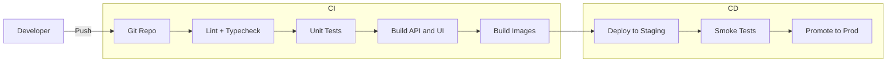

# CI/CD Pipeline

```mermaid
flowchart LR
    Dev[Developer] -->|Push| Git[Git Repo]

    subgraph CI
        Git --> Lint[Lint + Typecheck]
        Lint --> Test[Unit Tests]
        Test --> Build[Build API and UI]
        Build --> Package[Build Images]
    end

    subgraph CD
        Package --> Deploy[Deploy to Staging]
        Deploy --> Smoke[Smoke Tests]
        Smoke --> Promote[Promote to Prod]
    end
```
