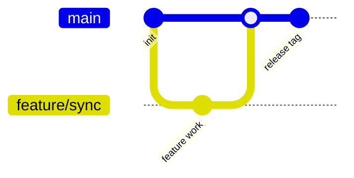

# Release Flow (Trunk Based)

```mermaid
gitGraph
    commit id: "init"
    branch feature/sync
    checkout feature/sync
    commit id: "feature work"
    checkout main
    merge feature/sync
    commit id: "release tag"
```
