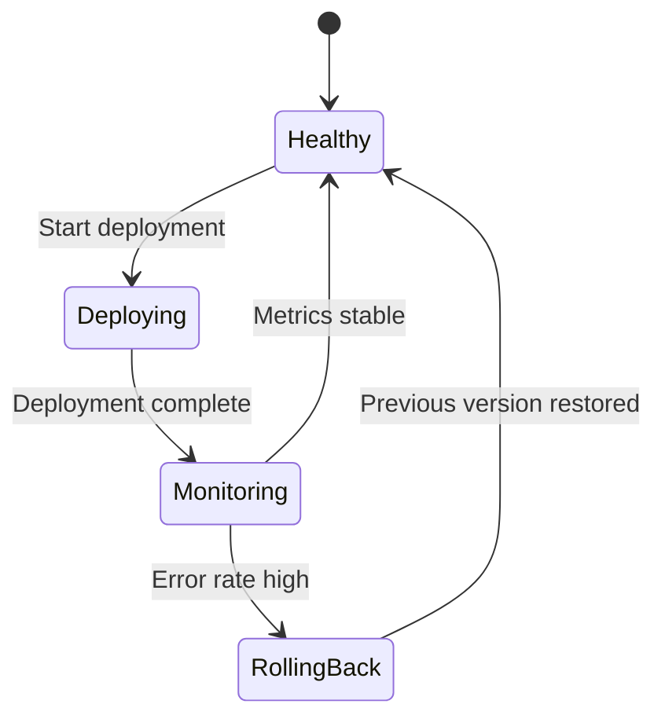

# Rollback and Recovery Strategy

```mermaid
stateDiagram-v2
    [*] --> Healthy
    Healthy --> Deploying: Start deployment
    Deploying --> Monitoring: Deployment complete
    Monitoring --> Healthy: Metrics stable
    Monitoring --> RollingBack: Error rate high
    RollingBack --> Healthy: Previous version restored
```

Rollback focuses on the control plane and worker images. Data integrity is protected by the sync ledger and run history.
