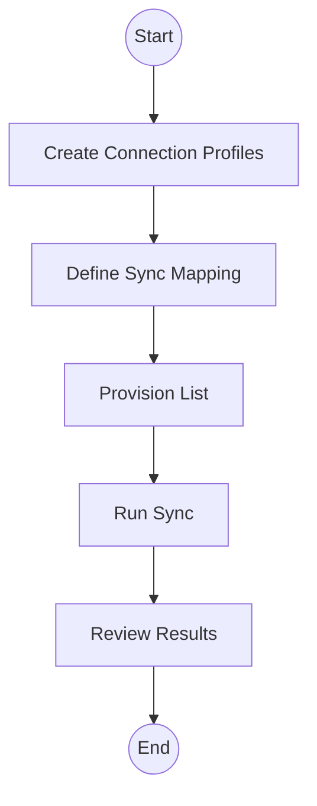

# User Flow Diagram

The primary flow is configuring and running a sync definition.

```mermaid
flowchart TD
    Start((Start)) --> Connect[Create Connection Profiles]
    Connect --> Define[Define Sync Mapping]
    Define --> Provision[Provision List]
    Provision --> Run[Run Sync]
    Run --> Review[Review Results]
    Review --> End((End))
```
