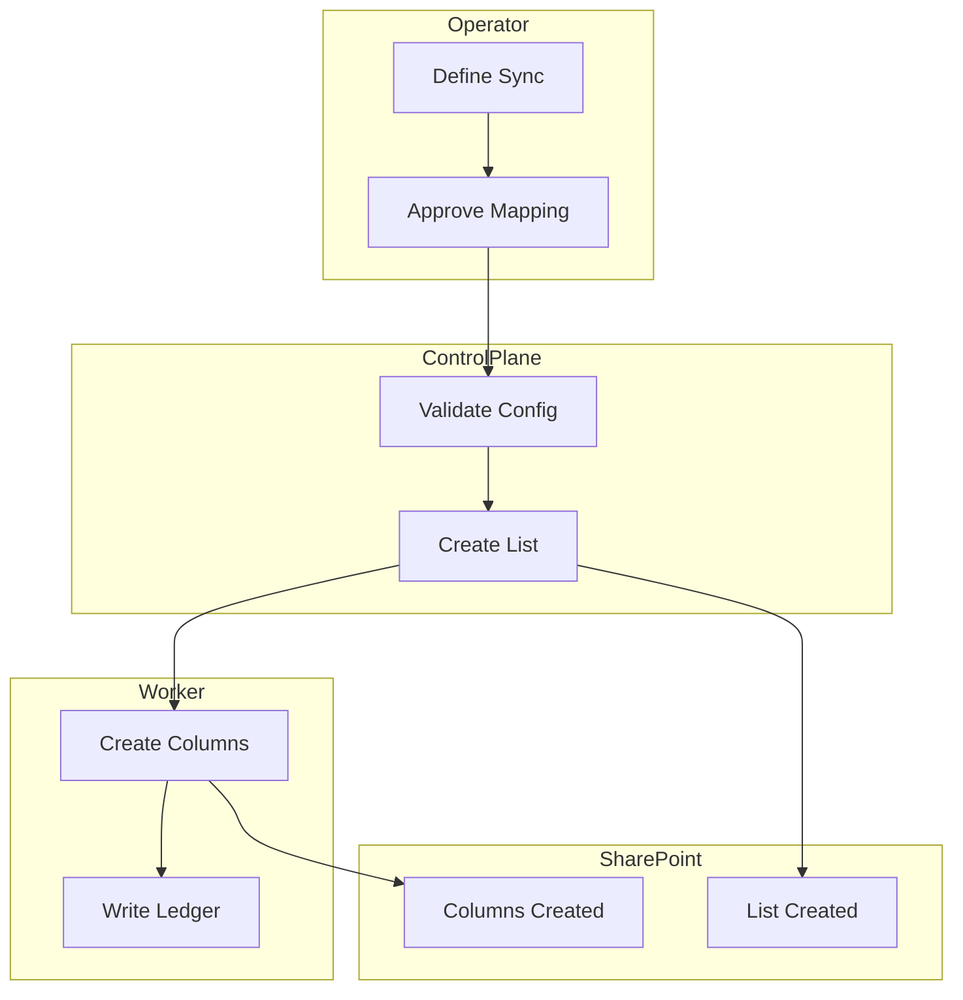

# Sync Provisioning Swimlanes

```mermaid
flowchart TD
    subgraph Operator
        A[Define Sync] --> B[Approve Mapping]
    end

    subgraph ControlPlane
        B --> C[Validate Config]
        C --> D[Create List]
    end

    subgraph Worker
        D --> E[Create Columns]
        E --> F[Write Ledger]
    end

    subgraph SharePoint
        D --> G[List Created]
        E --> H[Columns Created]
    end
```
