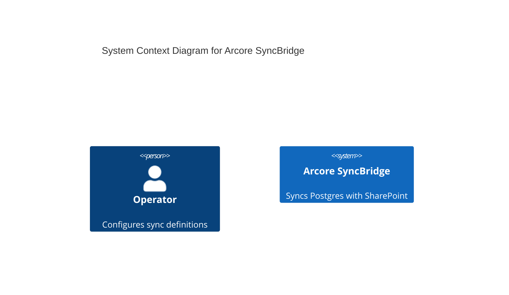
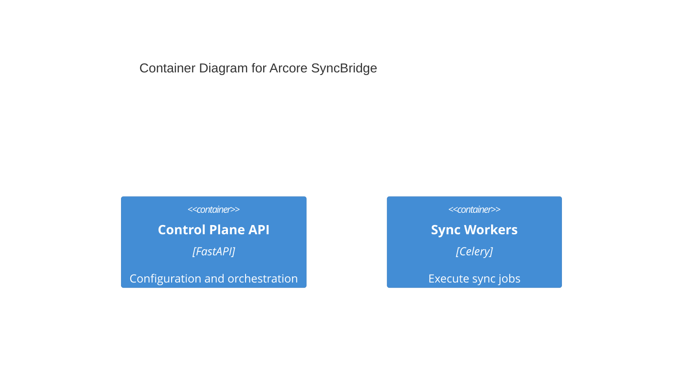
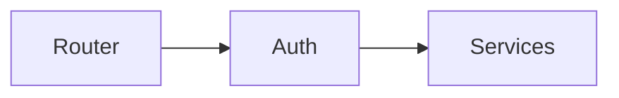
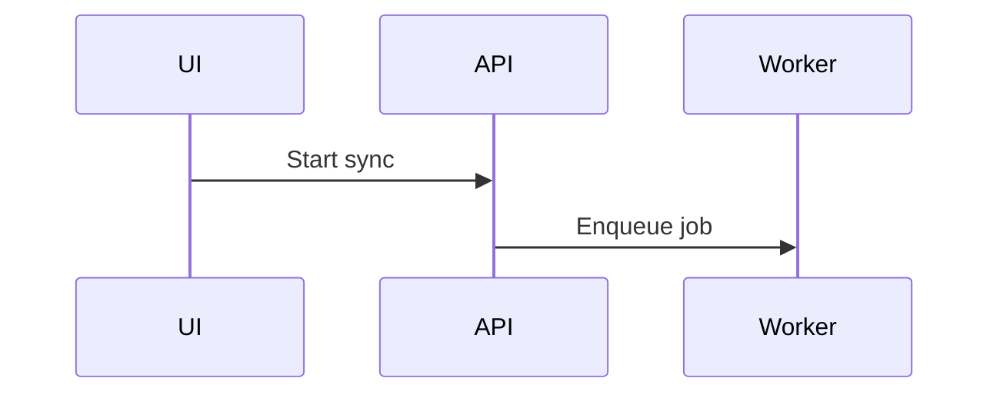

# Architecture Diagram Template

Use this structure when adding new Arcore SyncBridge diagrams. Prefer Mermaid so diagrams can be version-controlled.

## System Context

## Container View

## Component View

## Sequence Diagram (Core Flow)

